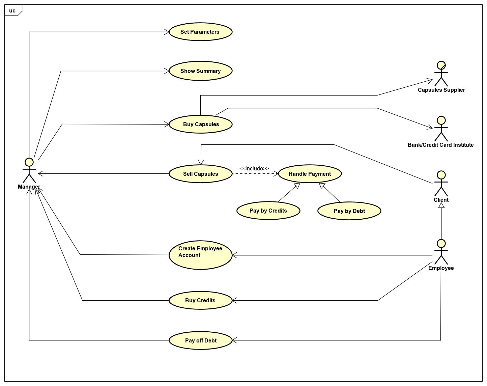

# Requirements Document Template

Authors:
- Rosetta Pagliuca s262725
- Raniero Pirraglia s263597
- Mohamed Mamdouh Tourab s259371
- Antonino Vitale 262665

Date:
03/29/2019

Version:
1.0

# Contents

- [Requirements Document Template](#requirements-document-template)
- [Contents](#contents)
- [Stakeholders](#stakeholders)
- [Context Diagram and interfaces](#context-diagram-and-interfaces)
  - [Context Diagram](#context-diagram)
  - [Interfaces](#interfaces)
- [Stories and personas](#stories-and-personas)
- [Functional and non functional requirements](#functional-and-non-functional-requirements)
  - [Functional Requirements](#functional-requirements)
  - [Non Functional Requirements](#non-functional-requirements)
- [Use case diagram and use cases](#use-case-diagram-and-use-cases)
  - [Use case diagram](#use-case-diagram)
  - [Use Cases](#use-cases)
    - [UC1: Create Employee account](#use-case-1-create-employee-account)
    - [UC2: Sell capsules](#use-case-2-sell-capsules)
    - [UC3: Buy capsules](#use-case-3-buy-capsules)
    - [UC4: Confirm order](#use-case-4-confirm-order)
    - [UC5: Show Summary](#use-case-5-show-summary)
    - [UC6: Pay off debts](#use-case-6-pay-off-debts)
    - [UC7: Buy Credits](#use-case-7-buy-credits)
    - [UC8: Set Parameters](#use-case-8-set-parameters)
- [Relevant scenarios](#relevant-scenarios)
  - [Successful capsules selling (cash payment)](#scenario-1-successful-capsules-selling-cash-payment)
  - [Successful capsules selling (credits payment)](#scenario-2-successful-capsules-selling-credits-payment)
  - [Successful capsules selling (debt payment)](#scenario-3-successful-capsules-selling-debt-payment)
  - [Unsuccessful capsules selling (debt payment, MaxDebt exceeded)](#scenario-4-unsuccessful-capsules-selling-debt-payment)
  - [Successful order of capsule boxes](#scenario-5-successful-order-of-capsule-boxes)
  - [Successful order confirmation](#scenario-6-successful-order-confirmation)
  - [Successful debt payment](#scenario-7-successful-debt-payment)
  - [Successful credits acquisition](#scenario-8-successful-credits-acquisition)
- [Glossary](#glossary)
- [System Design](#system-design)

# Stakeholders

| Stakeholder name   | Description |
| :-----------------:|:-----------:|
|   	 Manager       |     Manages the supply, the sales and the inventory of the coffee; manage Employee's account.        |
|    	Employees      |   Use the coffee machine; they can buy capsules for cash or on-account(if exists).       |
|    	Visitors       | Buy coffee for cash only.             |
|    	Coffee supplier       |       Managers contact them to buy coffee capsules .      |
|Software Developers   | The software developers who developed this application and provide maintenance. |
|CEO   |The Company CEO who buys this application to manage this process(Buying/Selling coffee capsules).   |
|Bank/Payment Method  |Bank is involved in payments for the coffee suppliers|

# Context Diagram and interfaces

## Context Diagram
```plantuml
left to right direction
skinparam packageStyle rectangle
actor Manager
actor "Coffee Supplier" as CS
actor "Credit Card System" as CCS
rectangle system{
	Manager --(LaTazza)
	(LaTazza)--CS
	CCS--(LaTazza)

}
```
## Interfaces
| Actor | Logical Interface | Physical Interface  |
| :-------------: |:-------------:| :-----:|
| With Manager      |GUI  |Screen,Keyboard  |
| With Credit Card system  |Web services API  | Internet Connection |
|Coffee supplier   |Website APIs to receive order   |Internet Connection   |


# Stories and personas
George Nespresso

Male, 55, Digital Consultancy Factory Manager,  Divorced with a teenage son


George is one the most important employee of his society, a little digital consultancy born quite recently but growing up quickly. He has to take care of the Factory, the company's branch involved in software developing. One of his tasks is to manage the sale and the supply of the coffee capsules. More specifically he has to order three boxes of capsules twice per month, the first one at the beginning of the month, the other one in the middle.  He must take care of the orders of capsules from both factory's members and visitors and company clients as well. In this case who wants to buy them has to pay. Therefore he must take care of who payed and who didn't.


Goals

- Wants an easy way to see the payment status of each employee
- Needs a system to buy capsules as soon as possible in order to not waste too much time


It's 1st of May morning.

George just arrived in his office and today will be a busy day. As it is the first day of month, he has to report the Factory's status and progress during an afternoon talk with the company board and he also has to manage the capsule supply. So he decided to order the coffee as soon as possible in order to save more time for the report preparation. First of all access with his manager account in LaTazza. He has to order three boxes of capsules for the employees. He checks what remains from the previous month in order to buy what misses. Coffee capsules are over and arabic coffee is going to be over soon whereas all the kinds of tea are still available because they have been bought the previous month. George decides to buy only coffee and arabic coffee in order to have a homogeneous distribution. He also check if any employee has debts. In that case, George sends a solicitation email to remind to pay. After these routine procedures of beginning month, George logs out and starts immediately working on the presentation for the afternoon talk.

# Functional and non functional requirements

## Functional Requirements

| ID   | Description                                                |
| ---- | :--------------------------------------------------------- |
| FR1  | Create employees account                                   |
| FR2  | Sell capsules                                              |
| FR3  | Buy capsules                                               |
| FR4  | Produce Summary                                            |
| FR5  | Manage employees debts/credits                             |
| FR6  | Manager log in                                             |
| FR7  | Manager log out                                            |
| FR8  | Summary update                                             |
| FR9  | Set maximum debt an employee can have (MaxDebt)            |
| FR10 | Set maximum expenditure for each order (MaxAmountPerOrder) |
| FR11 | Modify capsules price                                      |

## Non Functional Requirements

| ID    |    Type     |                     Description                     |                          Refers to |
| ----- | :---------: | :-------------------------------------------------: | ---------------------------------: |
| NFR1  | Portability |           At least on Windows and Mac OS            |                            LaTazza |
| NFR2  |    Space    |          At least 512 KB for each employee          |                            LaTazza |
| NFR3  |  Usability  |          One help popup for each function           |                            LaTazza |
| NFR4  | Efficiency  |       Transaction duration less than 1 second       |            FR1, FR2, FR3, FR5, FR8 |
| NFR5  | Efficiency  |     Transaction duration less than 0.5 seconds      |           FR4, FR6, FR7, FR9, FR10 |
| NFR6  | Reliability |         Probability of failure less than 1%         |           FR2, FR3, FR5, FR9, FR10 |
| NFR7  | Reliability |       Probability of failure less than 0.01%        |            FR1, FR4, FR6, FR7, FR8 |
| NFR8  | Robustness  | Restart duration after a failure less than 1 second |                      FR4, FR6, FR7 |
| NFR9  | Robustness  | Percentage of events causing failure less than 0.1% | FR1, FR2, FR3, FR5, FR8, FR9, FR10 |
| NFR10 | Robustness  |   Probability of data corruption less than 0.01%    | FR1, FR2, FR3, FR5, FR8, FR9, FR10 |

## Domain Requirements

| ID      | Description                              |
| ------- | :--------------------------------------- |
| Domain1 | The currency must be in Euro             |
| Domain2 | One credit is equal to a token of € 0.50 |

# Use case diagram and use cases


## Use case diagram

## Use Cases
In this paragraph are listed the most significant Use Cases of LaTazza system, with a brief description for each of them.
Log-In and Log-Out Use Cases are not described.
We assume that the company adopting LaTazza application has already defined a contract with capsules Supplier(s).

### Use Case 1, Create Employee account

An Employee can ask the Manager to create a LaTazza local account. An account grants the
  the possibility to buy credits (and pay using them instead of cash) and to take capsules in debt.
  The account creation process requires the Employee to choose only an username. A password is not needed since the account does not contain any sensible data.
  The accounts are stored in the Accounts_database.

| Actors Involved        | Manager, Employee |
| ------------- |:-------------|
|  Nominal Scenario     | The account is created once the Manager has entered the username choosen by the Employee.|
|  Variants     | The username choosen by the Employee is already taken. |


### Use case 2, Sell capsules
 This Use Case is triggerd by a Client's request to buy some capsules. As
  mentioned before, an Employee can also pay by Credits or take capsules in debt. These situations can be seen as variants of the sub-Use Case Handle Payment (see Use Case Diagram).
  Cash, Credits and Debt are the only payment method supported.
	For a definition of Credits, see Domain Requirements.

| Actors Involved        | Manager, Client|
| ------------- |:-------------|
|  Nominal Scenario     | The Client selects a payment method, chooses the capsule(s) number and typology, pays by cash and receives the capsule(s).|
|  Variants     | Credits payment; Debt payment; no capsules available for the selected number and/or typology; Employee exceeds MaxDebt threshold; thers isn't enough change.|

### Use case 3, Buy capsules

The Manager can issue an order to buy boxes of capsules with the company's
  Supplier. The payment is performed through the Bank/Credit Card System web APIs.
	Once an order is issued, it can't be canceled nor modified. For this reason, LaTazza does not allow to issue orders whose total amount exceeds the threshold value MaxAmountPerOrder (default is €100.00). The system does not automatically update the inventory after an order is issued, since the capsules are not yet available.

| Actors Involved        | Manager, Supplier, Bank/Credit Card Institute|
| ------------- |:-------------|
|  Nominal Scenario     | The Manager selects the amount and typology of capsules boxes, inserts credit card information and pays.|
|  Variants     | The amount exceeds the MaxAmountPerOrder threshold; Internet connection failure; invalid credit card data.|

### Use case 4, Confirm order

 Once the Manager has received and checked the content of the order he/she has
  issued, he/she has to notify it to the system, which had kept track of the order's information to facilitate the update.

| Actors Involved        | Manager|
| ------------- |:-------------|
|  Nominal Scenario     | The Manager looks for the order ID in the Orders List in the Summary window, confirms it.|
|  Variants     | System unable to correctly load orders' data. |

### Use case 5, Show Summary

LaTazza provides an overview of the status of the system called Summary. A
  Summary lists the following information: the Cash Account, the Inventory, the Orders List, the thresholds and capsules' prices set and a link to the Accounts Table. The Accounts Table's entries are tuples with the following attributes: account's Username, Credits, Debt.
	LaTazza automatically saves, once a day, a screenshot of the Summary as a read only file in the local file system.

| Actors Involved        | Manager|
| ------------- |:-------------|
|  Nominal Scenario     | The Manager clicks on Summary button and LaTazza shows it. |
|  Variants     | System failure while loading data; the system shows incorrect data.|

### Use case 6, Pay off debts
 An Employee asks to repay the debts he/she has, or part of it.
  An Employee can't have a debt higher than the threshold value MaxDebt (default is €20.00).

| Actors Involved        | Manager, Employee|
| ------------- |:-------------|
|  Nominal Scenario     | The Employee asks to repay the debt, handles cash to the Manager, the Manager updates the attribute "Debt" in the related entry of the Accounts Table.
|  Variants     | The Employee hasn't got sufficient cash to pay the debt. |   


### Use case 7, Buy Credits
An Employee asks the manager to buy Credits.

| Actors Involved        | Manager, Employee|
| ------------- |:-------------|
|  Nominal Scenario     | The Employee asks the Manager to buy some Credits and pays for them. The Manager updates the attribute "Credits" in the related entry of the Accounts Table.   |
|  Variants     | Employee has asked for a number of credits he/she can not afford.|

### Use case 8, Set Parameters
The Manager can modify the values of MaxAmountPerOrder and MaxDebt, as well as the prices of the different typology of capsules.
Capsules' prices range is between €0.20 and €5.00.
MaxAmountPerOrder value range is between €20.00 and €500.00.

| Actors Involved        | Manager|
| ------------- |:-------------|
|  Nominal Scenario     | The Manager successfully updates thresholds and/or prices.|
|  Variants     | Manager sets a value which is out of bounds. |


# Relevant scenarios

General Precondition: The Manager has logged in.

## Scenario 1: Successful capsules selling (cash payment)

Precondition: Inventory is not empty.

Postcondition: Cash Account and Inventory are updated.

| Scenario ID: SC1        | Corresponds to UC: Sell capsules|
| ------------- |:-------------:|
| Step#        | Description  |
|  1     | Client asks to buy capsules. |
|  2     | Manager clicks on the "Sell Capsules" button.|
|  3     | LaTazza shows the Sell Capsules window.   |
|  4     | Manager asks the Employee the payment method; Client replies that he/she wants to pay by cash. (Cash Payment, default option in the selling window) . |
|  5     | Manager asks the Client to tell him/her the number and typology of capsules; the Client replies providing the information.  |
|  6     | Manager fills the number field for each capsule typology choosen by the Client.|
|  7     | LaTazza performs a check to verify if the selected capsules are available in the inventory; the check confirms the availability.|
|  8     | LaTazza displays the amount in the "Amount" field.  |
|  9     | Manager tells the Client the amount.   |
|  10     | Client handles the cash to the Manager.   |
|  11    | Manager clicks on "Perform payment" button.   |
|  12    | LaTazza displays a confirmation dialog window; Manager clicks on "Yes".     |
|  13    | LaTazza updates the Summary ("Inventory" and "Cash account" fields.)|
|  14    | LaTazza displays a "Selling performed successfully!" popup.  |
|  15    | Manager gives the capsules to the Client. |

## Scenario 2: Successful capsules selling (credits payment)

Precondition: Employee has a LaTazza local account.

Postcondition: "Inventory" and attribute "Credits" of the Accounts table are updated.

| Scenario ID: SC2        | Corresponds to UC: Sell capsules|
| ------------- |:-------------:|
| Step#        | Description  |
|  1     | Employee asks to buy capsules. |
|  2     | Manager clicks on "Sell Capsules" button.|
|  3     | LaTazza shows the Sell Capsules window.  |
|  4     | Manager asks the Employee the payment method; Employee replies that he/she wants to pay by credits. |
|  5     | Manager checks the "Pay by credits" option.  |
|  6     | Manager asks the Employee to tell him/her the number and typology of capsules and his/her account's username; the Employee replies providing the information.|
|  7     | Manager fills the "Username" field and the number field for each capsule typology choosen by the Employee.|
|  8     | LaTazza performs a check to verify if the selected capsules are available in the inventory; the check confirms the availability.|
|  9     | LaTazza computes the amount, retrieves the attribute "Credits" in the Accounts Table and checks if the converted value of Credits is lower or equal to the amount computed; the check is passed. |
|  10     | LaTazza displays the amount in the "Amount" field, both in euro and credits. |
|  11     | Manager tells the Employee the amount, both in euro and credits and asks for confirmation; the Employee replies that the payment can be completed.|
|  12     | Manager clicks on "Perform Payment" button.   |
|  13      | LaTazza displays a confirmation dialog window, Manager clicks on "Yes".   |
|  14    | LaTazza updates the Summary ("Inventory" and attribute "Credits" of the related entry in Accounts Table.)|
|  15   | LaTazza displays a "Selling performed successfully" popup.  |

## Scenario 3: Successful capsules selling (debt payment)

Precondition: The Employee has a LaTazza local account.

Postcondition: Inventory and attribute "Debt" of the Accounts Table are updated.

| Scenario ID: SC3        | Corresponds to UC: Sell capsules|
| ------------- |:-------------:|
| Step#        | Description  |
|  1     | Employee asks to buy capsules. |
|  2     | Manager clicks on "Sell Capsules" button.|
|  3     | LaTazza shows the Sell Capsules window.  |
|  4     | Manager asks the Employee the payment method; Employee replies that he/she wants to buy capsule on debt. |
|  5     | Manager checks the "Debt Payment" option.  |
|  6     | Manager asks the Employee to tell him/her the number and typology of capsules and his/her account's username; the Employee replies providing the information.|
|  7     | Manager fills the "Username" field and the number field for each capsule typology choosen by the Employee.|
|  8     | LaTazza performs a check to verify if the selected capsules are available in the inventory; the check confirms the availability.|
|  9     | LaTazza computes the amount, retrieves the attribute "Debt" in the Accounts Table and checks if the selling would make it higher than MaxDebt; the check indicates that the selling can be performed.|
|  10     | LaTazza displays the amount in the "Amount" field.  |
|  11     | Manager tells the Employee the amount and asks for confirmation.   |
|  12     | Manager clicks on "Perform Payment" button.   |
|  13      | LaTazza displays a confirmation dialog window, Manager clicks on "Yes".   |
|  14    | LaTazza updates the Summary ("Inventory" and attribute "Debt" of the related entry in Accounts Table.)|
|  15   | LaTazza displays a "Selling performed successfully" popup.  |

## Scenario 4: Unsuccessful capsules selling (debt payment, MaxDebt exceeded)

Precondition: The Employee has a LaTazza local account.

Postcondition: Summary must not be updated.

| Scenario ID: SC4       | Corresponds to UC: Sell capsules|
| ------------- |:-------------:|
| Step#        | Description  |
|  1     | Employee asks to buy capsules. |
|  2     | Manager clicks on "Sell Capsules" button.|
|  3     | LaTazza shows the Sell Capsules window.  |
|  4     | Manager asks the Employee the payment method; Employee replies that he/she wants to buy capsule on debt. |
|  5     | Manager checks the "Debt Payment" option.  |
|  6     | Manager asks the Employee to tell him/her the number and typology of capsules and his/her account's username; the Employee replies providing the information.|
|  7     | Manager fills the "Username" field and the number field for each capsule typology choosen by the Employee.|
|  8     | LaTazza performs a check to verify if the selected capsules are available in the inventory; the check confirms the availability.|
|  9     | LaTazza computes the amount, retrieves the attribute "Debt" in the Accounts Table and checks if the selling would make it higher than MaxDebt; the check indicates that the selling can't be performed.|
|  10     | LaTazza displays a "The Employee has reached the maximum amount of Debt, the sale can't be performed" popup.   |
|  11     |The Manager notifies the Employee and asks if he/she wants to use another payment method. |
|  12     |Employee replies that he/she would like to stop the selling.  |
|  13      | The Manager clicks on "Cancel" button of the Sell Capsules window.|

## Scenario 5: Successful order of capsule boxes

Precondition: Internet connection works.

Postcondition: New order added in Orders List.

| Scenario ID: SC5       | Corresponds to UC: Buy capsules|
| ------------- |:-------------:|
| Step#        | Description  |
| 1   | Manager click on "Buy Capsules button"   |
| 2   | LaTazza shows the "Buy Capsules" window.   |
| 3   | Manager fills the number field for each typology of capsule he/she wants to buy.  |
| 4   | LaTazza computes the amount and checks if it is higher than the MaxAmountPerOrder threshold; the check indicates that the purchase can be performed.   |
| 5   | LaTazza displays the amount in the Amount field.   |
| 6   | Manager clicks on "Perform payment" button.  |
| 7   | LaTazza connects to Internet to show the Manager the Bank/Credit card institute payment window.    |
| 8   | The Manager fills the required fields to perform the payment (usually Credit Card number, expiration date and CVV/CVC) and clicks on "Complete Payment" button.   |
| 9   | The Bank/Credits card institute's system checks the payment validity; payment is valid. |
| 10  | The payment window disappears and LaTazza shows a popup window telling that the operation completed successfully.|
| 11  | LaTazza automatically issues the order via web using the APIs provided by the Supplier company.|
| 12  | LaTazza updates the Summary (it adds a new element in the Orders List).|

## Scenario 6: Successful order confirmation

Precondition: There must be at least one order not yet confirmed.

Postcondition: Inventory is updated.

| Scenario ID: SC6       | Corresponds to UC: Confirm Order|
| ------------- |:-------------:|
| Step#        | Description  |
| 1   | The Manager clicks on "Summary" button.  |
| 2   | LaTazza shows the "Summary" window.   |
| 3   | The Manager looks for the Order ID to confirm in the Orders List, clicks on it.|
| 4   | LaTazza shows a small recap window containing the order's information; the Manager checks it and closes the popup.  |
| 5   | The Manager clicks on "Confirm" button next to the related order.   |
| 6   | LaTazza marks the order as confirmed in the Orders List and updates the Inventory.   |

## Scenario 7: Successful debt payment

Precondition: Attribute "Debt" of the related entry of the Accounts Table must not be zero.

Postcondition: Attribute "Debt" is updated.

| Scenario ID: SC7       | Corresponds to UC: Pay off debt|
| ------------- |:-------------:|
| Step#        | Description  |
| 1   | The Employee asks the Manager to repay the debt on his/her account, providing the username. |
| 2   | The Manager clicks on "Accounts" button.    |
| 3   | LaTazza shows the Accounts window.   |
| 4   | The Manager looks for the Employee's entry in the Accounts Table.|
| 5   | The Manager tells the Employee the value of "Debt" and asks how much of it he/she wants to repay. |
| 6   | The Employee replies and handles the cash to the Manager.|
| 7   | The Manager clicks on "Pay Off Debt" button next to the entry in the Accounts Table. |
| 8   | LaTazza show a small window with a single field, "Amount"; the Manager fills the field and clicks the "Confirm" button.  |
| 9   | LaTazza updates the Summary ("Cash Account" and attribute "Debt" in the related Accounts Table entry). |

## Scenario 8: Successful credits acquisition

Precondition: The Employee has a LaTazza local account.

Postcondition:  Attribute "Credits" is updated.

| Scenario ID: SC8       | Corresponds to UC: Buy Credits|
| ------------- |:-------------:|
| Step#        | Description  |
| 1   | The Employee asks the Manager to buy credits and provides the username.|
| 2   | The Manager clicks on "Accounts" button.    |
| 3   | LaTazza shows the Accounts window.   |
| 4   | The Manager looks for the Employee's entry in the Accounts Table.|
| 5   | The Manager asks how many credits the Employee wants; the Employee replies providing the information. |
| 6   | The Manager clicks on "Update Credits" button. |
| 7   | LaTazza shows the Update Credits window.   |
| 8   | The Manager fills the "Number" field.  |
| 9   | LaTazza computes the amount (in euro) and displays it in the "Amount" field.|
| 10  | The Manager tells the Amount and asks confirmation to the Employee, who replies providing the cash.|
|  11    | Manager clicks on "Confirm" button.  |
|  12    | LaTazza updates the Summary ("Cash Account" and attribute "Credits" of the related entry in Accounts Table.)|

# Glossary

```plantuml
class Person{
+name
+surname
+ID
}
class Visitor{
}
class Employee {
+EmpolyeeID
}
class Manager{
}
class Account{
+username
+numberOfCredits
+debtAmount
}
class PaymentRecord{
+date
+amount
}
class Summary{
+cashAccount
+coffee
+arabicCoffee
+tea
+lemonTea
+camomileTea
+maxDebt
+maxAmountPerOrder
}
class Box{
}
class Capsule{
+type
}
class CapsulesSell{
+numberOfCapsules
+date
+amount
}
class CapsulesSupplyOrder{
+orderId
+numberOfBoxes
+date
+amount
}	


class CapsulesSupplier{
+ID
+name
+address
+phone
}

class CreditCard{
+ID
}

CapsulesSupplyOrder  -- PaymentRecord
PaymentRecord -- "0..1" CreditCard: is associated
note on link: Only if it regards buying capsules by the manager
CapsulesSupplyOrder "*" -- CapsulesSupplier
Employee <|-- Manager
Person <|-- Employee
Person <|-- Visitor
Employee -- "0..1" Account : has
Account "0..1" -- "*" PaymentRecord
note on link: Only if it regards an employee with an account , requesting payment with credits
Person -- "*" CapsulesSell : requests
CapsulesSell "*" -- Summary : updates
CapsulesSell -- PaymentRecord
Manager  -- Summary : handles
Manager  -- "*" CapsulesSell: performs
Manager -- "*" CapsulesSupplyOrder : requests
CapsulesSupplyOrder -- "1..*" Box
Box -- "50" Capsule
CapsulesSell -- "1..*" Capsule
Summary -- "*" Account: has in its table
Summary -- "*" CapsulesSupplyOrder: records

```

A person, described by her name, surname and ID, can be an employee or a visitor. An employee can have an account, on which the number of credits or debts is recorded. Moreover, one of the employees is a manager. Anyone can request for a capsules sell, specifying the number of capsules of a certain type. The sell is under the control of the manager and it is linked to a payment record, described by a date and amount, and, in the case the buyer is an employee having an account, the number of debts and credits can be changed on it. The sell updates the summary, so the amount of cash account (in euro) and the number of capsules for each type. The update of the summary can be handled by the manager too.
The manager can request a capsules supply, specifying the number of boxes of a certain type of 50 capsules. The payment is associated to a company's credit card.

# System Design
```plantuml
class "LaTazza System"{
sellCapsules()
buyCapsules()
showSummary()
updateSummary()
saveSummary()
showAccounts()
createAccount()
payOffDebts()
setParameters()
convertCredits()
}

class Accounts_database{
showAccounts()
createAccount()
payOffDebts()
convertCredits()
}

class Computer{
saveSummary()
}

class "Web Server"{
buyCapsules()
}
class Software{
}

"LaTazza System" o-- Accounts_database
"LaTazza System" o-- Computer
Computer -- Software
"LaTazza System" o-- "Web Server"
```
