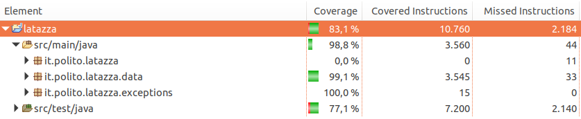
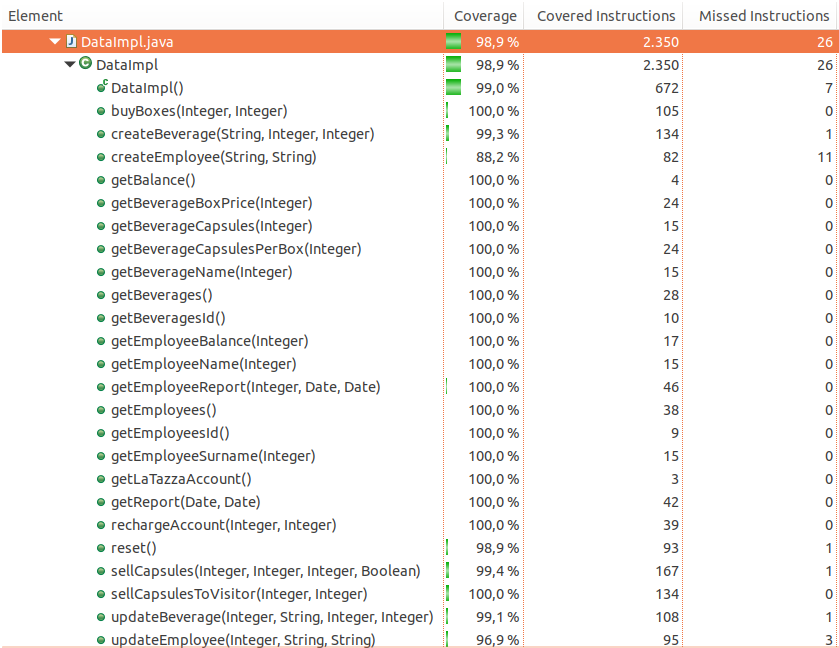
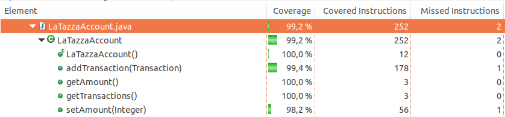
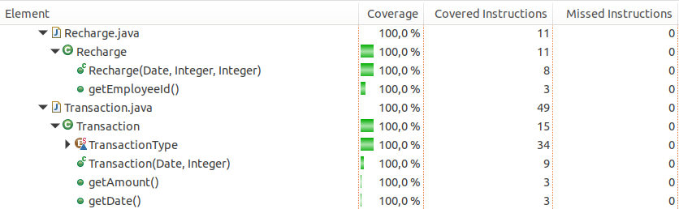
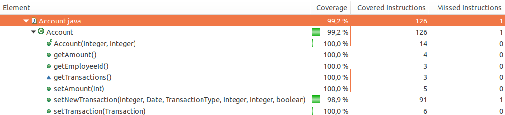
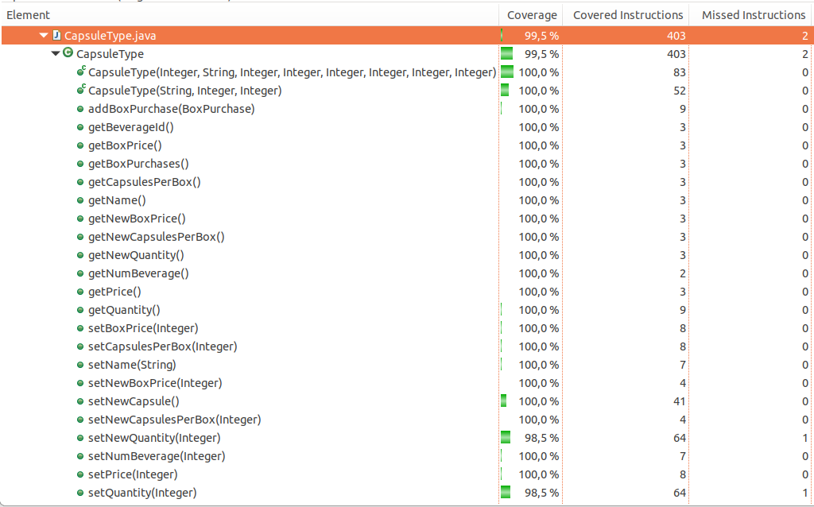
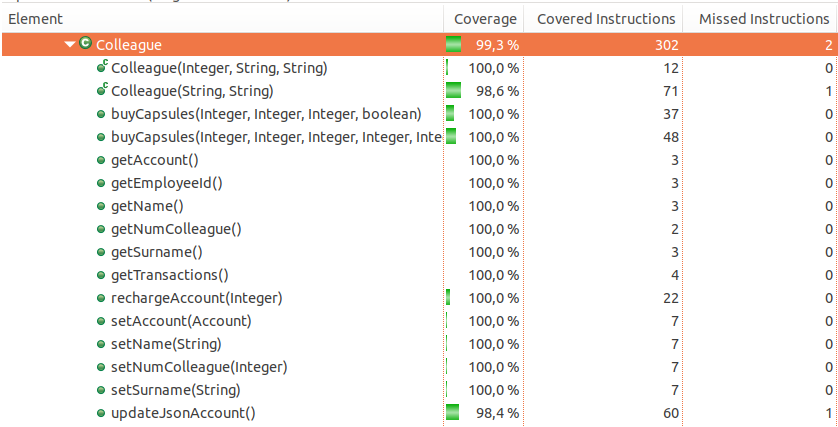
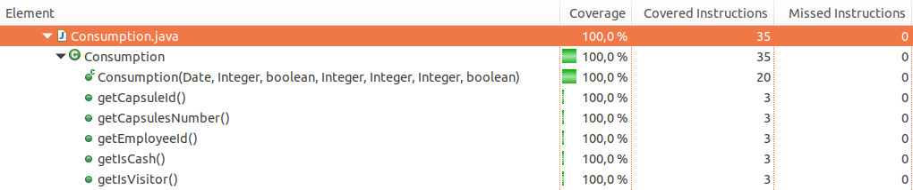
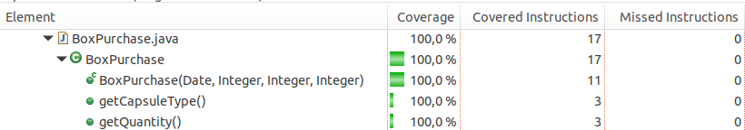
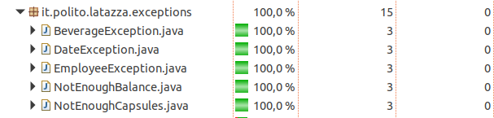

# Unit Testing Documentation template

Authors:

- Rosetta Pagliuca s262725
- Raniero Pirraglia s263597
- Mohamed Mamdouh Tourab s259371
- Antonino Vitale 262665

Date: 16/05/2019

Version 3:

- Added new test to cover the code lines related to the new feature "PriceChange".
- Improved black and white box tests to cover more line of codes, especially for Colleague and Capsule Type classes.
- New Coverage Report screenshots.


# Contents

- [Black Box Unit Tests](#black-box-unit-tests)


- [White Box Unit Tests](#white-box-unit-tests)

# Black Box Unit Tests

```
<Define here criteria, predicates and the combination of predicates for each function of each class.
Define test cases to cover all equivalence classes and boundary conditions.
In the table, report the description of the black box test case and the correspondence with the JUnit black box test case name/number>
```

### **Class DataImpl - method *createBeverage***

Prototype: Integer *createBeverage*(String **name**, Integer **capsulesPerBox**, Integer **boxPrice**)

Returns an Integer representing the beverageId of the created beverage.

**Criteria for method *createBeverage*:**

- Sign of **capsulesPerBox**  (input)
- Type of **capsulesPerBox** (input)
- Sign of **boxPrice** (input)
- Type of **boxPrice** (input)
- **name** is an acceptable beverage Name (input)
- The beverageId has to be >=0 (output)
- Creating two beverages will result in two different beverageId (output)
- It is not possible to create two beverages with the same name (output)

**Predicates for method *createBeverage*:**

| Criteria                                | Predicate        |
| --------------------------------------- | ---------------- |
| Sign of **capsulesPerBox**              | >0               |
|                                         | <=0              |
| Type of **capsulesPerBox**              | Integer          |
|                                         | null             |
| Sign of **boxPrice**                    | <=0              |
|                                         | >0               |
| Type of **boxPrice**                    | Integer          |
|                                         | null             |
| **name** is an acceptable beverage Name | Yes              |
|                                         | No (name = null) |
|                                         | No (name = "")   |


**Boundaries**:

| Criteria                   | Boundary values          |
| -------------------------- | ------------------------ |
| Sign of **capsulesPerBox** | minint, -1, 0, 1, maxint |
| Sign of **boxPrice**       | minint, -1, 0, 1, maxint |


**Combination of predicates**:

| Sign of capsulesPerBox | Type of capsulesPerBox | Sign of boxPrice | Type of boxPrice | name is an acceptable beverage Name | Valid / Invalid | Description of the test case                                 | JUnit test case                                              |
| ---------------------- | ---------------------- | ---------------- | ---------------- | ----------------------------------- | --------------- | ------------------------------------------------------------ | ------------------------------------------------------------ |
| >0                     | Integer                | >0               | Integer          | Yes                                 | V               | id = createBeverage("name", 1, 50) => <br /> getBeverageName(id) -> "name"; <br /> getBeverageCapsulesPerBox(id) -> 1; <br /> getBeverageBoxPrice(id) -> 50 | latazza/src/test/java/it/polito/latazza/data/TestDataImpl.java/TestCreateBeverage |
| X                      | null                   | >0               | Integer          | Yes                                 | I               | createBeverage("name", null, 50)  -> BeverageException       | Same as above                                                |
| >0                     | Integer                | X                | null             | Yes                                 | I               | createBeverage("name", 20 null)  -> BeverageException        | Same as above                                                |
| >0                     | Integer                | >0               | Integer          | No (name = null)                    | I               | createBeverage(null, 50, 100) -> Beverage Exception          | Same as above                                                |
| >0                     | Integer                | >0               | Integer          | No (name = "")                      | I               | createBeverage("", 50, 100) -> Beverage Exception            | Same as above                                                |
| >0                     | Integer                | <=0              | Integer          | Yes                                 | I               | createBeverage("name", 50, -1) -> Beverage Exception         | Same as above                                                |
| >0                     | Integer                | <=0              | Integer          | No                                  | I               | createBeverage("null", 50, 0) -> Beverage Exception          | Same as above                                                |
| <=0                    | Integer                | >0               | Integer          | Yes                                 | I               | createBeverage("name", -1, 1) -> Beverage Exception          | Same as above                                                |
| <=0                    | Integer                | >0               | Integer          | No                                  | I               | createBeverage(null, -1, 50) -> Beverage Exception           | Same as above                                                |
| <=0                    | Integer                | <=0              | Integer          | Yes                                 | I               | createBeverage("name", 0, -1) -> Beverage Exception          | Same as above                                                |
| <=0                    | Integer                | <=0              | Integer          | No                                  | I               | createBeverage(null, 0, 0) -> Beverage Exception             | Same as above                                                |

For Output Criterias:

| Criteria                                                     | Description                                                  | JUnitTestCase                                                |
| ------------------------------------------------------------ | ------------------------------------------------------------ | ------------------------------------------------------------ |
| The beverageId has to be >=0                                 | id = createBeverage("name", 20, 40) <br /> assertTrue(id>=0) | latazza/src/test/java/it/polito/latazza/data/TestDataImpl.java/TestCreateBeverage |
| Creating two beverages will result in two different beverageId | id1 = createBeverage("Coffee", 50, 100); <br /> id2 = createBeverage("Coke", 50, 100) <br /> assertNotEquals(id1, id2) | Same as above                                                |
| It is not possible to create two beverages with the same name | createBeverage("Coffee", 50, 100); <br /> createBeverage("Coffee", 20, 40) -> BeverageException | Same as above                                                |


### **Class DataImpl - method *getBeverageBoxPrice***

Prototype: Integer *getBeverageBoxPrice*(Integer **id**).

Returns the **boxPrice** of beverage with **id**.

**Criteria for method *getBeverageBoxPrice***:

- Sign of **id** (input): the tests on *createBeverage* have to confirm that **id** is >=0.
- **id** is associated to an existing beverage. (output)


**Predicates for method *getBeverageBoxPrice***:

| Criteria                                     | Predicate |
| -------------------------------------------- | --------- |
| **id** is associated to an existing beverage | Yes       |
| **id** is associated to an existing beverage | No        |


**Boundaries**:
None

**Combination of predicates**:

| **id** is associated to an existing beverage | Valid / Invalid | Description of the test case                                 | JUnit test case                                              |
| -------------------------------------------- | --------------- | ------------------------------------------------------------ | ------------------------------------------------------------ |
| Yes                                          | V               | createBeverage("name", 1, 50) -> id => getBeverageBoxPrice(id) -> 50 | latazza/src/test/java/it/polito/latazza/data/TestDataImpl.java/TestCreateBeverage |
| No                                           | I               | reset(); getBeverageBoxPrice(id) -> Beverage Exception       | latazza/src/test/java/it/polito/latazza/data/TestDataImpl.java/TestGetBeverageBoxPrice |

### **Class DataImpl - method *getBeverageCapsulesPerBox***

Similar to *getBeverageBoxPrice*. Only combination of predicates will be shown:

**Combination of predicates**:

| **id** is associated to an existing beverage | Valid / Invalid | Description of the test case                                 | JUnit test case                                              |
| -------------------------------------------- | --------------- | ------------------------------------------------------------ | ------------------------------------------------------------ |
| Yes                                          | V               | createBeverage("name", 1, 50) -> id => getBeverageCapsulesPerBox(id) -> 1 | latazza/src/test/java/it/polito/latazza/data/TestDataImpl.java/TestCreateBeverage |
| No                                           | I               | reset(); getBeverageCapsulesPerBox(id) -> Beverage Exception | latazza/src/test/java/it/polito/latazza/data/TestDataImpl.java/TestGetBeverageCapsulesPerBox |

### **Class DataImpl - method*getBeverageName***

Similar to *getBeverageBoxPrice*. Only combination of predicates will be shown:

| **id** is associated to an existing beverage | Valid / Invalid | Description of the test case                                 | JUnit test case                                              |
| -------------------------------------------- | --------------- | ------------------------------------------------------------ | ------------------------------------------------------------ |
| Yes                                          | V               | createBeverage("name", 1, 50) -> id => getBeverageName(id) -> "name" | latazza/src/test/java/it/polito/latazza/data/TestDataImpl.java/TestCreateBeverage |
| No                                           | I               | reset(); getBeverageName(id) -> Beverage Exception           | latazza/src/test/java/it/polito/latazza/data/TestDataImpl.java/TestGetBeverageName |

### **Class DataImpl - method *updateBeverage***

Prototype: void *updateBeverage*(Integer **id**, String **name**, Integer **capsulesPerBox**, Integer **boxPrice**)

**Criteria for method *updateBeverage***:

- **id** is associated to an existing beverage
- Type of **id**
- **name** is a valid String.
- Sign of **capsulesPerBox**
- Type of **capsulesPerBox**
- Sign of **boxPrice**
- Type of **boxPrice**

**Predicates for method *updateBeverage***:

| Criteria                                     | Predicate       |
| -------------------------------------------- | --------------- |
| **id** is associated to an existing beverage | Yes             |
|                                              | No              |
| Type of **id**                               | Integer         |
|                                              | null            |
| **name** is a valid String                   | Yes             |
|                                              | No (name =null) |
|                                              | No (name ="")   |
| Sign of **capsulesPerBox**                   | >0              |
|                                              | <=0             |
| Type of **capsulesPerBox**                   | Integer         |
|                                              | null            |
| Sign of **boxPrice**                         | >0              |
|                                              | <=0             |
| Type of **boxPrice**                         | Integer         |
|                                              | Null            |

**Boundaries**:

| Criteria                   | Boundary values |
| -------------------------- | --------------- |
| Sign of **capsulesPerBox** | -1, 0, 1        |
| Sign of **boxPrice**       | -1, 0, 1        |


**Combination of predicates**:

| **id** is associated to an existing beverage | Type of id | **name** is a valid String | Sign of **capsulesPerBox** | Type of capsulesPerBox | Sign of **boxPrice** | Type of boxPrice | Valid / Invalid | Description of the test case                                 | JUnit test case                                              |
| -------------------------------------------- | ---------- | -------------------------- | -------------------------- | ---------------------- | -------------------- | ---------------- | --------------- | ------------------------------------------------------------ | ------------------------------------------------------------ |
| Yes                                          | Integer    | Yes                        | >0                         | Integer                | >0                   | Integer          | V               | createBeverage("Coffee", 50, 100) -> id; <br /> updateBeverage(id, "Tea", 35, 70);<br />  getBeverageName(id) -> "Tea" <br />  ... | latazza/src/test/java/it/polito/latazza/data/TestDataImpl.java/TestUpdateBeverage |
| No                                           | null       | Yes                        | >0                         | Integer                | >0                   | Integer          | I               | createBeverage("Coffee", 50, 100) -> id; <br /> updateBeverage(null, "Tea", 35, 70) -> BeverageException | Same as above                                                |
| Yes                                          | Integer    | Yes                        | X                          | null                   | >0                   | Integer          | I               | createBeverage("Coffee", 50, 100) -> id; <br /> updateBeverage(id, "Tea", null 70) -> BeverageException | Same as above                                                |
| Yes                                          | Integer    | Yes                        | >0                         | Integer                | X                    | null             | I               | createBeverage("Coffee", 50, 100) -> id; <br /> updateBeverage(id, "Tea", 35, null) -> BeverageException | Same as above                                                |
| Yes                                          | Integer    | No (name = "")             | >0                         | Integer                | >0                   | Integer          | I               | createBeverage("Coffee", 50, 100) -> id; <br /> updateBeverage(id, "", 35, 70) -> BeverageException | Same as above                                                |
| No                                           | Integer    | Yes                        | Any                        | Integer                | Any                  | Integer          | I               | reset(); <br /> updateBeverage(5, "Tea", 35, 70) -> Beverage Exception | Same as above                                                |
| Yes                                          | Integer    | No(name = null)            | Any                        | Integer                | Any                  | Integer          | I               | createBeverage("Coffee", 50, 100) -> id; <br /> updateBeverage(id, null, 35, 70) -> Beverage Exception | Same as above                                                |
| Yes                                          | Integer    | Yes                        | <=0                        | Integer                | Any                  | Integer          | I               | createBeverage("Coffee", 50, 100) -> id; <br /> updateBeverage(id, "Tea", -1, 70) -> Beverage Exception | Same as above                                                |
| Yes                                          | Integer    | Yes                        | Any                        | Integer                | <=0                  | Integer          | I               | createBeverage("Coffee", 50, 100) -> id; <br /> updateBeverage(id, "Tea", 35, -1) -> Beverage Exception | Same as above                                                |

### **Class DataImpl - method *getBeverages***

Prototype: Map<Integer, String> *getBeverages*()

Returns a a map of identifiers and their corresponding strings.

**Criteria for method *getBeverages***:

- The list of beverages is null;

**Predicates for method *getBeverages***:

| Criteria                      | Predicate |
| ----------------------------- | --------- |
| The list of beverages is null | Yes       |
| The list of beverages is null | No        |

**Combination of predicates**:

| The list of beverages is null | Valid / Invalid | Description of the test case                                 | JUnit test case                                              |
| ----------------------------- | --------------- | ------------------------------------------------------------ | ------------------------------------------------------------ |
| No                            | V               | createBeverage("Coffee", 50, 100) -> id1;<br /> createBeverage("Tea", 25, 50) -> id2;<br />getBeverages() =><br /> {<id1," "Coffee">,<br /> <id2, "Tea">} | latazza/src/test/java/it/polito/latazza/data/TestDataImpl.java/TestGetBeverages |
| Yes                           | I               | reset();<br />getBeverages() -> {}                           | Same as above                                                |

### **Class DataImpl - method *getBeverageId***

Prototype: List<Integer> *getBeveragesId*()

Returns a a list of identifiers.

**Criteria for method *getBeverageId***:

- The list of beverages is null;

**Predicates for method *getBeverageId***:

| Criteria                      | Predicate |
| ----------------------------- | --------- |
| The list of beverages is null | Yes       |
| The list of beverages is null | No        |

**Combination of predicates**:

| The list of beverages is null | Valid / Invalid | Description of the test case                                 | JUnit test case                                              |
| ----------------------------- | --------------- | ------------------------------------------------------------ | ------------------------------------------------------------ |
| No                            | V               | createBeverage("Coffee", 50, 100) -> id1;<br /> createBeverage("Tea", 25, 50) -> id2;<br />getBeverageId() =><br /> {<id1,id2>} | latazza/src/test/java/it/polito/latazza/data/TestDataImpl.java/TestGetBeveragesId |
| Yes                           | I               | reset();<br />getBeverageId() -> {}                          | Same as above                                                |

### **Class DataImpl - method *getBeverageCapsules***

Prototype:Integer *getBeverageCapsules*(Integer **id**)

Returns the number of available capsules of a beverage.

**Criteria for method *getBeverageCapsules***:

- At least one BoxPurchase transaction in the transaction list => a capsule id already exists and, as createBeverage tests confirm, it is positve and unique.

**Predicates for method *getBeverageCapsules***:

| Criteria                                                     | Predicate |
| ------------------------------------------------------------ | --------- |
| At least one BoxPurchase transaction in the transaction list | Yes       |
| At least one BoxPurchase transaction in the transaction list | No        |


**Combination of predicates**:

| At least one BoxPurchase transaction in the transaction list | Valid / Invalid | Description of the test case                                 | JUnit test case                                              |
| ------------------------------------------------------------ | --------------- | ------------------------------------------------------------ | ------------------------------------------------------------ |
| Yes                                                          | V               | buyBoxes(5,1) -> new transaction in the transaction list;<br /> getBeverageCapsules(5) -><br />  getBeverageCapsulesPerBox(5) | latazza/src/test/java/it/polito/latazza/data/TestDataImpl.java/TestGetBeverageCapsules |
| No                                                           | I               | reset();<br />getBeverageCapsules(5) -> Beverage Exception   | Same as above                                                |


### **Class DataImpl - method *getBalance***

Prototype: Integer *getBalance()*

Returns the shared balance in cents.

**Criteria for method *getBalance*:**

- The method should track every LaTazzaAccount balance change (Output)

**Combination of predicates**:

| The method should track every LaTazzaAccount balance change | Description of the test case                                 | JUnit test case                                              |
| ----------------------------------------------------------- | ------------------------------------------------------------ | ------------------------------------------------------------ |
|                                                             | reset(); LaTazzaAccount.setAmount(1500) => <br /> LaTazzaAccount.getBalance() -> 1500; <br /> | latazza/src/test/java/it/polito/latazza/data/TestDataImpl.java/TestGetBalance |

### **Class *DataImpl* - method *getReport***


**Criteria for method getReport:**

- Date Value

**Predicates for method *getReport*:**


| Criteria   | Predicate                           |
| ---------- | ----------------------------------- |
| Date Value | startDate>endDate                   |
|            | startDate<endDate                   |
|            | startDate = Null                    |
|            | endDate = Null                      |
|            | startDate= Null<br />endDate = Null |

**Boundaries**:

| Criteria   | Boundary values     |
| ---------- | ------------------- |
| Date Value | 1/1/2015 - 1/1/2025 |

**Combination of predicates**:

| Date Value                        | Valid / Invalid | Description of the test case                                 | JUnit test case                                              |
| --------------------------------- | --------------- | ------------------------------------------------------------ | ------------------------------------------------------------ |
| startDate is bigger than endDate  | I               | try{<br />report = dataImpl.getReport(wrongStartDate, endDate);<br/>			fail();<br />} catch(DateException e1){<br />} | latazza/src/test/java/it/polito/latazza/data/TestDataImpl.java/TestGetReport |
| startDate Null                    | I               | try{<br />report = dataImpl.getReport(null, endDate);<br/>			fail();<br />} catch(DateException e1){<br />} | same as above                                                |
| endDate is Null                   | I               | try{<br />report = dataImpl.getReport(startDate, null);<br/>			fail();<br />} catch(DateException e1){<br />} | same as above                                                |
| both Dates are Null               | I               | try{<br />report = dataImpl.getReport(null, null);<br/>			fail();<br />} catch(DateException e1){<br />} | same as above                                                |
| startDate is smaller than endDate | V               | try{<br />report = dataImpl.getReport(startDate, endDate);<br/>			assertEquals(7, report.size());// 7 is the number of transactions happened} catch(DateException e1){<br />} | same as above                                                |


### **Class *DataImpl* - method *getEmployeeReport***


**Criteria for method getEmployeeReport:**

- Date Value
- Sign of employeeId
- Type of employeeId


**Predicates for method *name*:**

| Criteria           | Predicate                         |
| ------------------ | --------------------------------- |
| Date Value         | startDate>endDate                 |
|                    | startDate<endDate                 |
|                    | startDate= Null                   |
|                    | endDate = Null                    |
|                    | startDate=Null<br />endDate= Null |
| Sign of employeeId | >0 (wrong value)                  |
|                    | >0 (correct value)                |
|                    | <=0                               |

**Boundaries**:

| Criteria           | Boundary values     |
| ------------------ | ------------------- |
| Date Value         | 1/1/2015 - 1/1/2025 |
| Sign of employeeId | minint,0,maxint     |


**Combination of predicates**:

| Sign of employeeId | Date Value                              | Valid / Invalid | Description of the test case                                 | JUnit test case                                              |
| ------------------ | --------------------------------------- | --------------- | ------------------------------------------------------------ | ------------------------------------------------------------ |
| <=0                | startDate is bigger than endDate        | I               | try{<br />dataImpl.getEmployeeReport(-1, new Date(System.currentTimeMillis()), startDate);<br/>			fail();}<br />catch(EmployeeException\|DateException e1){} | latazza/src/test/java/it/polito/latazza/data/TestGetEmployeeReport |
| <=0                | startDate is smaller than endDate       | I               | try{<br />dataImpl.getEmployeeReport(-1, startDate, new Date(System.currentTimeMillis()));<br/>			fail();}<br />catch(EmployeeException \| DateException e){} | same as above                                                |
| <=0                | startDate is Null and End Date is wrong | I               | try{<br />dataImpl.getEmployeeReport(-1, null, startDate);<br/>			fail();<br />}<br />catch (EmployeeException \| DateException e1){} | same as above                                                |
| <=0                | StartDate correct and EndDate is null   | I               | try{<br />dataImpl.getEmployeeReport(-1, startDate, null);<br/>			fail();}<br />catch(EmployeeException \| DateException e1) | same as above                                                |
| <=0                | Both Dates NULL                         | I               | try{<br />dataImpl.getEmployeeReport(-1, null, null);<br/>			fail();}<br />catch(EmployeeException \| DateException e1){} | same as above                                                |
| >0                 | startDate is bigger than endDate        | I               | try{<br />dataImpl.getEmployeeReport(1000, new Date(System.currentTimeMillis()), startDate);<br/>			fail();<br />}catch(EmployeeException \| DateException e1){} | same as above                                                |
| >0                 | startDate is null EndDate is wrong      | I               | try{<br />dataImpl.getEmployeeReport(1000, null, startDate);<br/>			fail();<br />}<br />catch(EmployeeException \| DateException e1){} | same as above                                                |
| >0                 | startDate correct and endDate NULL      | I               | try{<br />dataImpl.getEmployeeReport(-1, startDate, null);<br/>			fail();}<br />catch(EmployeeException \| DateException e1){} | same as above                                                |
| >0                 | Both Dates are NULL                     | I               | try{<br />dataImpl.getEmployeeReport(1000, null, null);<br/>			fail();<br />}<br />catch(EmployeeException \| DateException e1){} | same as above                                                |
| >0                 | startDate is smaller than endDate       | V               | try{<br />report=dataImpl.getEmployeeReport(employeeId, startDate, endDate);<br/>assertEquals(5, report.size());}<br />catch(EmployeeException \| DateException e1) | same as above                                                |
| >0                 | startDate is bigger than endDate        | I               | try{<br />dataImpl.getEmployeeReport(employeeId, new Date(System.	()), startDate);<br/>			fail();<br />}<br />catch(EmployeeException \|DateException e1){} | same as above                                                |


### **Class *DataImpl* - method *createEmployee***


**Criteria for method *createEmployee*:**

- String name value
- String surname value


**Predicates for method *createEmployee*:**

| Criteria             | Predicate |
| -------------------- | --------- |
| String name value    | not null  |
|                      | null      |
|                      | ""        |
| String surname value | not null  |
|                      | null      |
|                      | ""        |


**Boundaries**:

| Criteria | Boundary values |
| -------- | --------------- |
|          |                 |
|          |                 |


**Combination of predicates**:

| String name value | String surname value | Valid / Invalid | Description of the test case                                 | JUnit test case                                              |
| ----------------- | -------------------- | --------------- | ------------------------------------------------------------ | ------------------------------------------------------------ |
| not null          | not null             | V               | Integer employeeId = di.createEmployee("not null", "not null");<br/>			assertTrue(employeeId >= 0); | latazza/src/test/java/it/polito/latazza/data/TestCreateEmployee |
|                   | null                 | I               | try{di.createEmployee("not null", null);<br/>			fail();}catch(EmployeeException e){} | latazza/src/test/java/it/polito/latazza/data/TestCreateEmployee |
| null              | not null             | I               | try{di.createEmployee(null, "not null");<br/>			fail();}catch(EmployeeException e){} | latazza/src/test/java/it/polito/latazza/data/TestCreateEmployee |
|                   | null                 | I               | try{di.createEmployee(null,null);<br/>			fail();}catch(EmployeeException e){} | latazza/src/test/java/it/polito/latazza/data/TestCreateEmployee |
| ""                | not null             | I               | try {<br/>			di.createEmployee("", "Surname");<br/>			fail();<br/>		} catch (EmployeeException e) {<br/>			<br/>		} | latazza/src/test/java/it/polito/latazza/data/TestCreateEmployee |
| not null          | ""                   | I               | try {<br/>			di.createEmployee("Name", "");<br/>			fail();<br/>		} catch (EmployeeException e) {<br/>			// OK<br/>		} | latazza/src/test/java/it/polito/latazza/data/TestCreateEmployee |


### Class *DataImpl* - method *getEmployeeBalance*


**Criteria for method *getEmployeeBalance*:**

- Sign of integer id
- Existence of integer id


**Predicates for method *getEmployeeBalance*:**

| Criteria                | Predicate |
| ----------------------- | --------- |
| Sign of integer id      | >= 0      |
|                         | < 0       |
| Existence of integer id | Yes       |
|                         | Not       |


**Boundaries**:

| Criteria           | Boundary values   |
| ------------------ | ----------------- |
| Sign of integer id | Minint, 0, Maxint |


**Combination of predicates**:

| Sign of integer id | Existence of integer id | Valid / Invalid | Description of the test case                                 | JUnit test case                                              |
| ------------------ | ----------------------- | --------------- | ------------------------------------------------------------ | ------------------------------------------------------------ |
| >= 0               | Yes                     | V               | di.rechargeAccount(employeeId1, 5000);<br/>			Integer balance = di.getEmployeeBalance(employeeId1);<br/>			assertEquals(5000, balance.intValue()); | latazza/src/test/java/it/polito/latazza/data/TestGetEmployeeBalance |
|                    | No                      | I               | try{Integer balance = di.getEmployeeBalance(40); <br />fail();} catch(EmployeeException e ){ } | latazza/src/test/java/it/polito/latazza/data/TestGetEmployeeBalance |
| < 0                | Yes                     | I               |                                                              |                                                              |
|                    | No                      | I               | try{Integer balance = di.getEmployeeBalance(-5);<br /> fail();} catch(EmployeeException e ){ } | latazza/src/test/java/it/polito/latazza/data/TestGetEmployeeBalance |

### **Class *DataImpl* - method *getEmployeeName***


**Criteria for method *getEmployeeName*:**

- Sign of integer id
- Existence of integer id


**Predicates for method *getEmployeeName*:**

| Criteria                | Predicate |
| ----------------------- | --------- |
| Sign of integer id      | >= 0      |
|                         | < 0       |
| Existence of integer id | Yes       |
|                         | Not       |


**Boundaries**:

| Criteria           | Boundary values   |
| ------------------ | ----------------- |
| Sign of integer id | Minint, 0, Maxint |


**Combination of predicates**:

| Sign of integer id | Existence of integer id | Valid / Invalid | Description of the test case                                 | JUnit test case                                              |
| ------------------ | ----------------------- | --------------- | ------------------------------------------------------------ | ------------------------------------------------------------ |
| >= 0               | Yes                     | V               | String name = di.getEmployeeName(employeeId1);<br/>			assertEquals("Nino", name); | latazza/src/test/java/it/polito/latazza/data/TestGetEmployeeName |
|                    | No                      | I               | try{di.getEmployeeName(49); <br />fail();} catch(EmployeeException e ){ } | latazza/src/test/java/it/polito/latazza/data/TestGetEmployeeName |
| < 0                | Yes                     | I               |                                                              |                                                              |
|                    | No                      | I               | try{di.getEmployeeName(-30); <br />fail();} catch(EmployeeException e ){ } | latazza/src/test/java/it/polito/latazza/data/TestGetEmployeeName |

### **Class *DataImpl* - method *getEmployeeSurname***


**Criteria for method *getEmployeeSurname*:**

- Sign of integer id
- Existence of integer id


**Predicates for method *getEmployeeSurname*:**

| Criteria                | Predicate |
| ----------------------- | --------- |
| Sign of integer id      | >= 0      |
|                         | < 0       |
| Existence of integer id | Yes       |
|                         | Not       |


**Boundaries**:

| Criteria           | Boundary values   |
| ------------------ | ----------------- |
| Sign of integer id | Minint, 0, Maxint |


**Combination of predicates**:

| Sign of integer id | Existence of integer id | Valid / Invalid | Description of the test case                                 | JUnit test case                                              |
| ------------------ | ----------------------- | --------------- | ------------------------------------------------------------ | ------------------------------------------------------------ |
| >= 0               | Yes                     | V               | Integer employeeId1 = di.createEmployee("Nino", "Vitale");<br/>					String name = di.getEmployeeSurname(employeeId1);<br/>			assertEquals("Vitale", name); | latazza/src/test/java/it/polito/latazza/data/TestGetEmployeeSurname |
|                    | No                      | I               | try{di.getEmployeeSurname(49);<br/>			fail();}catch(EmployeeException e){} | latazza/src/test/java/it/polito/latazza/data/TestGetEmployeeSurname |
| < 0                | Yes                     | I               |                                                              |                                                              |
|                    | No                      | I               | try{di.getEmployeeSurname(-30);<br/>			fail();}catch(EmployeeException e){} | latazza/src/test/java/it/polito/latazza/data/TestGetEmployeeSurname |

### **Class *DataImpl* - method *rechargeAccount***


**Criteria for method *rechargeAccount*:**

- Sign of integer id
- Existence of integer id
- Sign of integer amountInCents


**Predicates for method *rechargeAccount*:**

| Criteria                      | Predicate |
| ----------------------------- | --------- |
| Sign of integer id            | >= 0      |
|                               | < 0       |
| Existence of integer id       | Yes       |
|                               | Not       |
| Sign of integer amountInCents | > 0       |
|                               | <= 0      |


**Boundaries**:

| Criteria                      | Boundary values   |
| ----------------------------- | ----------------- |
| Sign of integer id            | Minint, 0, Maxint |
| Sign of integer amountInCents | Minint, 0, Maxint |


**Combination of predicates**:

| Sign of integer id | Existence of integer id | Sign of integer amountInCents | Valid / Invalid | Description of the test case                                 | JUnit test case                                              |
| ------------------ | ----------------------- | ----------------------------- | --------------- | ------------------------------------------------------------ | ------------------------------------------------------------ |
| >= 0               | Yes                     | >= 0                          | V               | Integer employeeId1 = di.createEmployee("Nino", "Vitale");<br/>Integer totAmount = di.rechargeAccount(employeeId1, 5000);<br/>assertEquals(5000, totAmount.intValue()); | latazza/src/test/java/it/polito/latazza/data/TestRechargeAccount |
|                    |                         | < 0                           | I               | try{di.rechargeAccount(di.getEmployeesId().get(0), -1);<br/>			fail();}catch(EmployeeException e ){} | latazza/src/test/java/it/polito/latazza/data/TestRechargeAccount |
|                    | No                      | >= 0                          | I               | try{di.rechargeAccount(di.getEmployeesId().get(1) +1, 5000);<br/>			fail();}catch(EmployeeException e ){} | latazza/src/test/java/it/polito/latazza/data/TestRechargeAccount |
|                    |                         | < 0                           | I               | try{di.rechargeAccount(di.getEmployeesId().get(1) +1, -1);<br/>			fail();}catch(EmployeeException e ){} | latazza/src/test/java/it/polito/latazza/data/TestRechargeAccount |
| < 0                | Any case                | Any case                      | I               | try{di.rechargeAccount(-1, 5000);<br/>			fail();}catch(EmployeeException e ){}<br/>try{di.rechargeAccount(-1, -1);<br/>			fail();}catch(EmployeeException e ){} | latazza/src/test/java/it/polito/latazza/data/TestRechargeAccount |


### **Class *DataImpl* - method *updateEmployee***


**Criteria for method *updateEmployee*:**

- Sign of integer id
- Existence of integer id
- String name value
- String surname value

**Predicates for method *updateEmployee*:**

| Criteria                | Predicate |
| ----------------------- | --------- |
| Sign of integer id      | >= 0      |
|                         | < 0       |
| Existence of integer id | Yes       |
|                         | Not       |
| String name value       | not null  |
|                         | null      |
|                         | ""        |
| String surname value    | not null  |
|                         | null      |
|                         | ""        |


**Boundaries**:

| Criteria                      | Boundary values   |
| ----------------------------- | ----------------- |
| Sign of integer id            | Minint, 0, Maxint |
| Sign of integer amountInCents | Minint, 0, Maxint |


**Combination of predicates**:

| Sign of integer id | Existence of integer id | String name value | String surname value | Valid / Invalid | Description of the test case                                 | JUnit test case                                              |
| ------------------ | ----------------------- | ----------------- | -------------------- | --------------- | ------------------------------------------------------------ | ------------------------------------------------------------ |
| >= 0               | Yes                     | not null          | not null             | V               | di.updateEmployee(eid, "Antonino", "Vitale");<br/>			assertTrue("AntoninoVitale".equals(di.getEmployeeName(eid) + di.getEmployeeSurname(eid))); | latazza/src/test/java/it/polito/latazza/data/DataImpl.java/TestUpdateEmployee |
|                    |                         |                   | null                 | I               | try{di.updateEmployee(eid, "Nino", null);<br/>			fail();}catch(EmployeeException e ){} | Same as above                                                |
|                    |                         |                   | ""                   | I               | try {<br/>			di.updateEmployee(eid, "Nino", "");<br/>			fail();<br/>		} catch (EmployeeException e) {<br/>			// OK<br/>		} | Same as above                                                |
|                    |                         | null              | not null             | I               | try{di.updateEmployee(eid, null, "Vitale");<br/>			fail();}catch(EmployeeException e ){} | Same as above                                                |
|                    |                         |                   | null                 | I               | try{di.updateEmployee(eid, null, null);<br/>			fail();}catch(EmployeeException e ){} | Same as above                                                |
|                    |                         | ""                | not null             | I               | try {<br/>			di.updateEmployee(eid, "", "Vitale");<br/>			fail();<br/>		} catch (EmployeeException e) {<br/>			// OK<br/>		} | Same as above                                                |
|                    | No                      | not null          | not null             | I               |                                                              |                                                              |
|                    |                         |                   | null                 | I               | try{di.updateEmployee(eid +1,"Nino", null);<br/>			fail();}catch(EmployeeException e ){} | Same as above                                                |
|                    |                         | null              | not null             | I               | try{di.updateEmployee(eid, null, "Vitale");<br/>			fail();}catch(EmployeeException e ){} | Same as above                                                |
|                    |                         |                   | null                 | I               | try{di.updateEmployee(eid, null, null);<br/>			fail();}catch(EmployeeException e ){} | Same as above                                                |
| < 0                | Any case                | Any case          | Any case             | I               | try{di.updateEmployee(-1, "Nino", "Vitale");<br/>			fail();}catch(EmployeeException e ){}<br/>try{di.updateEmployee(-1, "Nino", null);<br/>			fail();}catch(EmployeeException e ){}<br/>try{di.updateEmployee(-1, null, "Vitale");<br/>			fail();}catch(EmployeeException e ){}<br/>try{di.updateEmployee(-1, null, null);<br/>			fail();}catch(EmployeeException e ){}<br/> | Same as above                                                |

### **Class *DataImpl* - method *sellCapsules***


**Criteria for method *name*:**

- Sign of employeeId
- Type of employeeId
- Sign of beverageId
- Type of beverageId
- Sign of numberOfCapsules
- Type of numberOfCapsules
- Enough numberOfCapsules
- Value of fromAccount


**Predicates for method *name*:**

| Criteria                 | Predicate |
| ------------------------ | --------- |
| Sign of employeeId       | >=0       |
|                          | <0        |
| Type of employeeId       | Integer   |
|                          | null      |
| Sign of beverageId       | >=0       |
|                          | <0        |
| Type of beverageId       | Integer   |
|                          | null      |
| Sign of numberOfCapsules | >=0       |
|                          | <0        |
| Type of numberOfCapsules | Integer   |
|                          | null      |
| Enough numberOfCapsules  | True      |
|                          | False     |


**Boundaries**:

| Criteria                 | Boundary values   |
| ------------------------ | ----------------- |
| Sign of employeeId       | minint, 0, maxint |
| Sign of beverageId       | minint, 0, maxint |
| Sign of numberOfCapsules | minint, 0, maxint |


**Combination of predicates**:

| Sign of employeeId | Type of employeeId | Sign of beverageId | Type of beverageId | Sign of numberOfCapsules | Type of numberOfCapsules | Enough numberOfCapsules | Value of fromAccount | Valid / Invalid | Description of the test case                                 | JUnit test case                                              |
| ------------------ | ------------------ | ------------------ | ------------------ | ------------------------ | ------------------------ | ----------------------- | -------------------- | --------------- | ------------------------------------------------------------ | ------------------------------------------------------------ |
| >=0                | Integer            | >=0                | Integer            | >=0                      | Integer                  | True                    | True                 | V               | previousQuantity = dataImpl.getEmployeeBalance(eid);<br/>			newQuantity = dataImpl.sellCapsules(eid, bid, 5 , true);<br/>			assertEquals(newQuantity.intValue(), previousQuantity - 5 * dataImpl.getBeverageBoxPrice(bid) * 100 / dataImpl.getBeverageCapsulesPerBox(bid)); | latazza/src/test/java/it/polito/latazza/data/TestDataImpl.java/TestSellCapsules |
|                    |                    |                    |                    |                          |                          |                         | False                | V               | previousQuantity = dataImpl.getLaTazzaAccount().getAmount(); dataImpl.sellCapsules(eid, bid, 5, false);newQuantity = previousQuantity + 5 dataImpl.getBeverageBoxPrice(bid)/ dataImpl.getBeverageCapsulesPerBox(bid); assertEquals(dataImpl.getLaTazzaAccount().getAmount(), newQuantity ); | Same as above                                                |
| X                  | null               | >=0                | Integer            | >=0                      | Integer                  | True                    | True                 | I               | dataImpl.sellCapsules(null, bid, 5, true) -> EmployeeException | Same as above                                                |
| >=0                | Integer            | X                  | null               | >=0                      | Integer                  | True                    | True                 | I               | dataImpl.sellCapsules(eid, null, 5, true) -> BeverageException | Same as above                                                |
| >=0                | Integer            | >=0                | Integer            | X                        | null                     | True                    | True                 | I               | dataImpl.sellCapsules(eid, bid, null, true) -Z NotEnoughCapsuleException | Same as above                                                |
|                    |                    |                    |                    |                          |                          | False                   | True                 | I               |                                                              |                                                              |
|                    |                    |                    |                    |                          |                          |                         | False                | I               |                                                              |                                                              |
|                    |                    |                    |                    | <0                       |                          | True                    | True                 | I               | previousQuantity = dataImpl.getEmployeeBalance(eid);<br/>			newQuantity = dataImpl.sellCapsules(eid, bid, -5 , true);<br/>			assertEquals(newQuantity.intValue(), previousQuantity.intValue()); | latazza/src/test/java/it/polito/latazza/data/TestDataImpl.java/TestSellCapsules |
|                    |                    |                    |                    |                          |                          |                         | False                | I               |                                                              |                                                              |
|                    |                    |                    |                    |                          |                          | False                   | True                 | I               |                                                              |                                                              |
|                    |                    |                    |                    |                          |                          |                         | False                | I               |                                                              |                                                              |
|                    |                    | <0                 |                    | >=0                      |                          | True                    | True                 | I               | try{dataImpl.sellCapsules(eid, -1, 5 , true);<br/>			fail();} | latazza/src/test/java/it/polito/latazza/data/TestDataImpl.java/TestSellCapsules |
|                    |                    |                    |                    |                          |                          |                         | False                | I               |                                                              |                                                              |
|                    |                    |                    |                    |                          |                          | False                   | True                 | I               |                                                              |                                                              |
|                    |                    |                    |                    |                          |                          |                         | False                | I               |                                                              |                                                              |
|                    |                    |                    |                    | <0                       |                          | True                    | True                 | I               |                                                              | latazza/src/test/java/it/polito/latazza/data/TestDataImpl.java/TestSellCapsules |
|                    |                    |                    |                    |                          |                          |                         | False                | I               |                                                              |                                                              |
|                    |                    |                    |                    |                          |                          | False                   | True                 | I               |                                                              |                                                              |
|                    |                    |                    |                    |                          |                          |                         | False                | I               |                                                              |                                                              |
| <0                 |                    | >=0                |                    | >=0                      |                          | True                    | True                 | I               | try{dataImpl.sellCapsules(-1, bid, 5 , true);<br/>			fail();} | latazza/src/test/java/it/polito/latazza/data/TestDataImpl.java/TestSellCapsules |
|                    |                    |                    |                    |                          |                          |                         | False                | I               |                                                              |                                                              |
|                    |                    |                    |                    |                          |                          | False                   | True                 | I               |                                                              |                                                              |
|                    |                    |                    |                    |                          |                          |                         | False                | I               |                                                              |                                                              |
|                    |                    |                    |                    | <0                       |                          | True                    | True                 | I               | dataImpl.sellCapsules(-1, bid, 5 , true);<br/>			fail(); | latazza/src/test/java/it/polito/latazza/data/TestDataImpl.java/TestSellCapsules |
|                    |                    |                    |                    |                          |                          |                         | False                | I               |                                                              |                                                              |
|                    |                    |                    |                    |                          |                          | False                   | True                 | I               |                                                              |                                                              |
|                    |                    |                    |                    |                          |                          |                         | False                | I               |                                                              |                                                              |
|                    |                    | <0                 |                    | >=0                      |                          | True                    | True                 | I               | try{dataImpl.sellCapsules(-1, -1, 5 , true);<br/>			fail();} | latazza/src/test/java/it/polito/latazza/data/TestDataImpl.java/TestSellCapsules |
|                    |                    |                    |                    |                          |                          |                         | False                | I               |                                                              |                                                              |
|                    |                    |                    |                    |                          |                          | False                   | True                 | I               |                                                              |                                                              |
|                    |                    |                    |                    |                          |                          |                         | False                | I               |                                                              |                                                              |
|                    |                    |                    |                    | <0                       |                          | True                    | True                 | I               | ...                                                          | latazza/src/test/java/it/polito/latazza/data/TestDataImpl.java/TestSellCapsules |
|                    |                    |                    |                    |                          |                          |                         | False                | I               |                                                              |                                                              |
|                    |                    |                    |                    |                          |                          | False                   | True                 | I               |                                                              |                                                              |
|                    |                    |                    |                    |                          |                          |                         | False                | I               |                                                              |                                                              |


### **Class *DataImpl*- method *sellCapsulesToVisitor***


**Criteria for method *sellCapsulesToVisitor*:**

- Sign of beverageId
- Type of beverageId
- Sign of numberOfCapsules
- Type of numberOfCapsules
- Existence of beverage
- Enough numberOfCapsules


**Predicates for method *sellCapsulesToVisitor*:**

| Criteria                 | Predicate |
| ------------------------ | --------- |
| Sign of beverageId       | >= 0      |
|                          | < 0       |
| Type of beverageId       | Integer   |
|                          | null      |
| Sign of numberOfCapsules | >= 0      |
|                          | < 0       |
| Type of numberOfCapsules | Integer   |
|                          | null      |
| Existence of beverage    | True      |
|                          | False     |
| Enough numberOfCapsules  | True      |
|                          | False     |


**Boundaries**:

| Criteria                 | Boundary values    |
| ------------------------ | ------------------ |
| Sign of beverageId       | minint, 0 , maxint |
| Sign of numberOfCapsules | minint, 0 , maxint |


**Combination of predicates**:

| Sign of beverageId | Type of beverageId | Sign of numberOfCapsules | Type of numberOfCapsules | Existence of beverage | Enough numberOfCapsules | Valid / Invalid | Description of the test case                                 | JUnit test case                                              |
| ------------------ | ------------------ | ------------------------ | ------------------------ | --------------------- | ----------------------- | --------------- | ------------------------------------------------------------ | ------------------------------------------------------------ |
| >=0                | Integer            | >= 0                     | Integer                  | True                  | True                    | V               | di.sellCapsulesToVisitor(bid, 2);<br/>			assertEquals(26, di.getLaTazzaAccount().getAmount().intValue());<br/>			assertEquals(48, di.getBeverageCapsules(bid).intValue()); | latazza/src/test/java/it/polito/latazza/data/TestDataImpl.java/TestSellCapsulesToVisitor |
| X                  | null               | >=0                      | Integer                  | True                  | True                    | I               | di.sellCapsulesToVisitor(null, 5) -> BeverageException       | Same as above                                                |
| >=0                | Integer            | X                        | null                     | True                  | True                    | I               | di.sellCapsulesToVisitor(bid, null) -> NotEnoughCapsuleException | Same as above                                                |
|                    |                    |                          |                          |                       | False                   | I               | try{di.sellCapsulesToVisitor(bid, 3000);<br/>			fail();}catch(BeverageException){} | latazza/src/test/java/it/polito/latazza/data/TestDataImpl.java/TestSellCapsulesToVisitor |
|                    |                    |                          |                          | False                 | True                    | I               | try{di.sellCapsulesToVisitor(bid + 1, 1);<br/>			fail();}catch(BeverageException){} | latazza/src/test/java/it/polito/latazza/data/TestDataImpl.java/TestSellCapsulesToVisitor |
|                    |                    |                          |                          |                       | False                   | I               | try{di.sellCapsulesToVisitor(bid + 1, 3000);<br/>			fail();}catch(BeverageException){} | latazza/src/test/java/it/polito/latazza/data/TestDataImpl.java/TestSellCapsulesToVisitor |
|                    |                    | < 0                      |                          | True                  | True                    | I               | try{di.sellCapsulesToVisitor(bid , -1);<br/>			fail();}catch(BeverageException){} | latazza/src/test/java/it/polito/latazza/data/TestDataImpl.java/TestSellCapsulesToVisitor |
|                    |                    |                          |                          |                       | False                   | I               |                                                              |                                                              |
|                    |                    |                          |                          | False                 | True                    | I               | try{di.sellCapsulesToVisitor(bid+1 , -1);<br/>			fail();}catch(BeverageException){} | latazza/src/test/java/it/polito/latazza/data/TestDataImpl.java/TestSellCapsulesToVisitor |
|                    |                    |                          |                          |                       | False                   | I               |                                                              |                                                              |
| < 0                |                    | >= 0                     |                          | True                  | True                    | I               |                                                              |                                                              |
|                    |                    |                          |                          |                       | False                   | I               |                                                              |                                                              |
|                    |                    |                          |                          | False                 | True                    | I               | try{di.sellCapsulesToVisitor(-1, 1);<br/>			fail();}catch(BeverageException){} | latazza/src/test/java/it/polito/latazza/data/TestDataImpl.java/TestSellCapsulesToVisitor |
|                    |                    |                          |                          |                       | False                   | I               | try{di.sellCapsulesToVisitor(-1, 3000);<br/>			fail();}catch(BeverageException){} | latazza/src/test/java/it/polito/latazza/data/TestDataImpl.java/TestSellCapsulesToVisitor |
|                    |                    | <0                       |                          | True                  | True                    | I               |                                                              |                                                              |
|                    |                    |                          |                          |                       | False                   | I               |                                                              |                                                              |
|                    |                    |                          |                          | False                 | True                    | I               | try{di.sellCapsulesToVisitor(-1, -1);<br/>			fail();}catch(BeverageException){} | latazza/src/test/java/it/polito/latazza/data/TestDataImpl.java/TestSellCapsulesToVisitor |
|                    |                    |                          |                          |                       | False                   | I               |                                                              |                                                              |


### Class *DataImpl* - method *BuyBoxes*


**Criteria for method *BuyBoxes*:**

- Sign of BeverageId
- Sign of boxQuantity


**Predicates for method *BuyBoxes*:**

| Criteria           | Predicate |
| ------------------ | --------- |
| Sign of BeverageId | >=0       |
|                    | <0        |
| Type of BeverageId | Integer   |
|                    | Others    |


**Boundaries**:

| Criteria            | Boundary values    |
| ------------------- | ------------------ |
| Sign of BeverageId  | minint, 0, maxint  |
| Sign of boxQuantity | minint, 0,  maxint |


**Combination of predicates**:

| Sign of beverageId | Sign of boxQuantity | Valid / Invalid | Description of the test case                                 | JUnit test case                                              |
| ------------------ | ------------------- | --------------- | ------------------------------------------------------------ | ------------------------------------------------------------ |
| >= 0               | >0                  | V               | previousQuantity=dataImpl.getBeverageCapsules(id1);<br />dataImpl.buyBoxes(id1, 1);<br />newQuantity=dataImpl.getBeverageCapsules(id1);<br /> assertEquals(newQuantity.intValue(), previousQuantity + dataImpl.getBeverageCapsulesPerBox(id1)); | latazza/src/test/java/it/polito/latazza/data/TestDataImpl.java/TestBuyBoxes() |
| >=0                | <=0                 | I               | previousQuantity=dataImpl.getBeverageCapsules(id1);<br/>			dataImpl.buyBoxes(id1, -12);<br/>			newQuantity=dataImpl.getBeverageCapsules(id1);<br/>			assertEquals(previousQuantity.intValue(), newQuantity.intValue()); | latazza/src/test/java/it/polito/latazza/data/TestDataImpl.java/TestBuyBoxes() |
| <0                 | >0                  | I               | dataImpl.buyBoxes(-5, 63) -> Beverage Exception              | Same as above                                                |
| <0                 | <=0                 | I               | dataImpl.buyBoxes(-5, -63) - Beverage Exception              | Same as above                                                |

### **Class *Account*- method *setAmount***


**Criteria for method *setAmount*:**

- Sign of amount


**Predicates for method *setAmount*:**

| Criteria       | Predicate |
| -------------- | --------- |
| Sign of amount | >=0       |
|                | <0        |


**Boundaries**:

| Criteria       | Boundary values    |
| -------------- | ------------------ |
| Sign of amount | minint, 0 , maxint |


**Combination of predicates**:

| Sign of amount | Valid / Invalid | Description of the test case                                 | JUnit test case                                              |
| -------------- | --------------- | ------------------------------------------------------------ | ------------------------------------------------------------ |
| >=0            | V               | Integer previousAmount=account.getAmount();<br/>		account.setAmount(200);<br/>		Integer newAmount=account.getAmount();<br/>		assertEquals(200, newAmount.intValue()); | latazza/src/test/java/it/polito/latazza/data/TestAccount.java/TestSetAmount |
| <0             | V               | previousAmount=account.getAmount();<br/>		account.setAmount(-10);<br/>		newAmount=account.getAmount();<br/>		assertEquals(-10, newAmount.intValue()); | latazza/src/test/java/it/polito/latazza/data/TestAccount.java/TestSetAmount |


### **Class *Account*- method *setNewTransaction***

**Criteria for method *setNewTransaction*:**

- Sign of amount
- Date value
- Sign of capsuleId
- Sign of capsulesNumber


**Predicates for method *setNewTransaction*:**

| Criteria               | Predicate                 |
| ---------------------- | ------------------------- |
| Sign of amount         | >=0                       |
|                        | <0                        |
| Date value             | >=1/1/2015 && <1/1/2025   |
|                        | <1/1/2015 \|\| >=1/1/2025 |
| Type value             | RECHARGE                  |
|                        | CONSUMPTION               |
|                        | Other                     |
| Sign of capsuleId      | >=0                       |
|                        | <0                        |
| Sign of capsulesNumber | >=0                       |
|                        | <0                        |


**Boundaries**:

| Criteria               | Boundary values     |
| ---------------------- | ------------------- |
| Sign of amount         | minint, 0 , maxint  |
| Date value             | 1/1/2015 - 1/1/2025 |
| Sign of capsulesNumber | minint, 0, maxint   |
| Sign of capsuleId      | minint, 0, maxint   |


**Combination of predicates**:

| Sign of amount | Date value                | Type value                | Sign of capsuleId | Sign of capsulesNumber | Valid / Invalid | Description of the test case                                 | JUnit test case                                              |
| -------------- | ------------------------- | ------------------------- | ----------------- | ---------------------- | --------------- | ------------------------------------------------------------ | ------------------------------------------------------------ |
| >=0            | >=1/1/2015 && <1/1/2025   | RECHARGE \|\| CONSUMPTION | >=0               | >=0                    | V               | Transaction newTransaction= account.setNewTransaction(10, new Date(System.currentTimeMillis()), TransactionType.RECHARGE, 10 , 20, false);<br/>	    assertEquals(true, account.getTransactions().contains(newTransaction));<br /><br />newTransaction= account.setNewTransaction(10, new Date(System.currentTimeMillis()), TransactionType.CONSUMPTION, 10 ,20,  false);<br/>	    assertEquals(true, account.getTransactions().contains(newTransaction)); | latazza/src/test/java/it/polito/latazza/data/TestAccount.java/TestSetNewTransaction() |
|                |                           | CONSUMPTION               |                   | <0                     | I               | newTransaction= account.setNewTransaction(10, new Date(System.currentTimeMillis()), TransactionType.CONSUMPTION, null , -10 , false);<br/>	    assertEquals(null,newTransaction); | latazza/src/test/java/it/polito/latazza/data/TestAccount.java/TestSetNewTransaction() |
|                |                           | RECHARGE                  |                   | <0                     | V               | newTransaction= account.setNewTransaction(10, new Date(System.currentTimeMillis()), TransactionType.RECHARGE, null , -10 , false);<br/>	    assertEquals(true, account.getTransactions().contains(newTransaction)); | latazza/src/test/java/it/polito/latazza/data/TestAccount.java/TestSetNewTransaction() |
|                |                           | CONSUMPTION               |                   | null                   | I               | newTransaction= account.setNewTransaction(10, new Date(System.currentTimeMillis()), TransactionType.CONSUMPTION, 10, null , false);<br/>	    assertEquals(null,newTransaction); | latazza/src/test/java/it/polito/latazza/data/TestAccount.java/TestSetNewTransaction() |
|                |                           | RECHARGE                  |                   | null                   | V               | newTransaction= account.setNewTransaction(10, new Date(System.currentTimeMillis()), TransactionType.RECHARGE, 10, null, false);<br/>	    assertEquals(true, account.getTransactions().contains(newTransaction)); | latazza/src/test/java/it/polito/latazza/data/TestAccount.java/TestSetNewTransaction() |
|                |                           | CONSUMPTION               | <0                |                        | I               | newTransaction= account.setNewTransaction(10, new Date(System.currentTimeMillis()), TransactionType.CONSUMPTION, -10 , null , false);<br/>	    assertEquals(null,newTransaction); | latazza/src/test/java/it/polito/latazza/data/TestAccount.java/TestSetNewTransaction() |
|                |                           | RECHARGE                  | <0                |                        | V               | newTransaction= account.setNewTransaction(10, new Date(System.currentTimeMillis()), TransactionType.RECHARGE, -10 , null , false);<br/>	    assertEquals(true, account.getTransactions().contains(newTransaction)); | latazza/src/test/java/it/polito/latazza/data/TestAccount.java/TestSetNewTransaction() |
|                |                           | CONSUMPTION               | null              |                        | I               | newTransaction= account.setNewTransaction(10, new Date(System.currentTimeMillis()), TransactionType.CONSUMPTION, null , 10, false);<br/>	    assertEquals(null,newTransaction); | latazza/src/test/java/it/polito/latazza/data/TestAccount.java/TestSetNewTransaction() |
|                |                           | RECHARGE                  | null              |                        | V               | newTransaction= account.setNewTransaction(10, new DateSystem.currentTimeMillis()), TransactionType.RECHARGE, null , 10, false);<br/>	    assertEquals(true, account.getTransactions().contains(newTransaction)); | latazza/src/test/java/it/polito/latazza/data/TestAccount.java/TestSetNewTransaction() |
|                | <1/1/2015 \|\| >=1/1/2025 |                           |                   |                        | I               | newTransaction= account.setNewTransaction(-10, formatter.parse("01/01/2000"), TransactionType.CONSUMPTION, 10 , 20 , false);<br/>			assertEquals(null,newTransaction);<br/>		    newTransaction= account.setNewTransaction(-10, formatter.parse("01/01/2100"), TransactionType.CONSUMPTION, 10 , 20 , false);<br/>		    assertEquals(null,newTransaction); | latazza/src/test/java/it/polito/latazza/data/TestAccount.java/TestSetNewTransaction() |
| <0             |                           |                           |                   |                        | I               | newTransaction= account.setNewTransaction(-10, new Date(System.currentTimeMillis()), TransactionType.CONSUMPTION, 10 , null , false);<br/>	    assertEquals(null,newTransaction); | latazza/src/test/java/it/polito/latazza/data/TestAccount.java/TestSetNewTransaction() |

### **Class CapsuleType - method *addBoxPurchase***

Prototype: void *addBoxPurchase*(BoxPurchase **bp**)

Adds **bp** to the transaction list.

**Criteria for method *addBoxPurchase*:**

- **bp** is null.

**Predicates for method *addBoxPurchase*:**

| Criteria       | Predicate |
| -------------- | --------- |
| **bp** is null | No        |
| **bp** is null | Yes       |

**Combination of predicates**:

| **bp** is null | Valid / Invalid | Description of the test case                                 | JUnit test case                                              |
| -------------- | --------------- | ------------------------------------------------------------ | ------------------------------------------------------------ |
| No             | V               | CapsuleType ct = new CapsuleType("..."); <br />  BoxPurchase bp = new BoxPurchase("...");<br />  ct.addBoxPurchase(); => <br /> ct.getBoxPurchases().contains(bp) -> true | latazza/src/test/java/it/polito/latazza/data/TestCapsuleType.java/TestAddBoxPurchase |
| Yes            | I               | bp=null; <br /> ct.addBoxPurchase(bp); => <br /> ct.getBoxPurchases.contains(bp) -> false | Same as aboxe                                                |

### **Class CapsuleType - method *setBoxPrice***

Prototype: void *setBoxPrice*(Integer **boxPrice**)

**Criteria for method *setBoxPrice*:**

- Sign of **boxPrice**

**Predicates for method *setBoxPrice*:**

| Criteria             | Predicate |
| -------------------- | --------- |
| Sign of **boxPrice** | >0        |
| Sign of **boxPrice** | <=0       |

**Boundaries**:

| Criteria             | Boundary values |
| -------------------- | --------------- |
| Sign of **boxPrice** | -1, 0, 1        |

**Combination of predicates**:

| Sign of boxPrice | Valid / Invalid | Description of the test case                                 | JUnit test case                                              |
| ---------------- | --------------- | ------------------------------------------------------------ | ------------------------------------------------------------ |
| >0               | V               | CapsuleType ct = new CapsuleType(""); <br />  ct.setBoxPrice(1); <br />  ct.getBoxPrice() -> 1; | latazza/src/test/java/it/polito/latazza/data/TestCapsuleType.java/TestSetBoxPrice |
| <0               | I               | ct.setBoxPrice(-1); <br /> ct.getBoxPrice() -> previous valid value | Same as above                                                |
| =0               | I               | ct.setBoxPrice(-1); <br /> ct.getBoxPrice() -> previous valid value | Same as above                                                |

### **Class CapsuleType - method *setCapsulesPerBox***

Prototype: void *setCapsulesPerBox*(Integer **capsulesPerBox**)

**Criteria for method *setCapsulesPerBox*:**

- Sign of **capsulesPerBox**

**Predicates for method *setCapsulesPerBox*:**

| Criteria                   | Predicate |
| -------------------------- | --------- |
| Sign of **capsulesPerBox** | >0        |
| Sign of **capsulesPerBox** | <=0       |

**Boundaries**:

| Criteria                   | Predicate |
| -------------------------- | --------- |
| Sign of **capsulesPerBox** | -1,0,1    |

**Combination of predicates**:

| Sign of capsulesPerBox | Valid / Invalid | Description of the test case                                 | JUnit test case                                              |
| ---------------------- | --------------- | ------------------------------------------------------------ | ------------------------------------------------------------ |
| >0                     | V               | CapsuleType ct = new CapsuleType("..."); <br />  ct.setCapsulesPerBox(1); <br />  ct.getCapsulePerBox() -> 1; | latazza/src/test/java/it/polito/latazza/data/TestCapsuleType.java/TestSetCapsulePerBox |
| <0                     | I               | ct.setCapsulesPerBox(-1); <br /> ct.getCapsulePerBox() -> previous valid value | Same as above                                                |
| =0                     | I               | ct.setCapsulesPerBox(-1); <br /> ct.getCapsulePerBox() -> previous valid value | Same as above                                                |

### **Class CapsuleType - method *setName***

Prototype: void *setName*(String **name**)

**Criteria for method *setName*:**

- **name** is a null string.

**Predicates for method *setName*:**

| Criteria                  | Predicate |
| ------------------------- | --------- |
| **name** is a null string | No        |
| **name** is a null string | Yes       |

**Combination of predicates**:

| name is a null String | Valid / Invalid | Description of the test case                                 | JUnit test case                                              |
| --------------------- | --------------- | ------------------------------------------------------------ | ------------------------------------------------------------ |
| No                    | V               | CapsuleType ct = new CapsuleType("..."); <br /> ct.setName("Tea"): <br />  => ct.getName() -> "Tea" | latazza/src/test/java/it/polito/latazza/data/TestCapsuleType.java/TestSeName |
| Yes                   | I               | ct.setName(null); <br /> ct.getName() -> previous valid name | Same as above                                                |

### **Class CapsuleType - method *setNumBeverage***

Same criteria, predicates and boundaries as **setBoxPrice**.

JUni test case: *latazza/src/test/java/it/polito/latazza/data/TestCapsuleType.java/TestNumBeverage*

### **Class CapsuleType - method *setPrice***

Same criteria, predicates and boundaries as **setBoxPrice**.

JUni test case: *latazza/src/test/java/it/polito/latazza/data/TestCapsuleType.java/TestSetPrice*

### **Class CapsuleType - method *setQuantity***

Same criteria, predicates and boundaries as **setPrice**.

JUni test case: *latazza/src/test/java/it/polito/latazza/data/TestCapsuleType.java/TestSetQuantity*


### **Class CapsuleType - method *setNewQuantity***

Same criteria, predicates and boundaries as **setQuantity

JUni test case: *latazza/src/test/java/it/polito/latazza/data/TestCapsuleType.java/TestSetNewQuantity*

### **Class Colleague - method *buyCapsule***

 Prototype: Transaction *buyCapsules*(Integer *price*, Integer *num*, Integer *capsuleId*, boolean *isCash*)

**Criteria for method *buyCapsule*:**

- Sign of **price**
- Sign of **num**
- Sign of **capsuleId**
- Sign of **isCash**

**Predicates for method *buyCapsule*:**

| Criteria              | Predicate |
| --------------------- | --------- |
| Sign of **price**     | <=0       |
| Sign of **price**     | >0        |
| Sign of **num**       | <=0       |
| Sign of **num**       | >0        |
| Sign of **capsuleId** | >=0       |
| Sign of **capsuleId** | <0        |
| Sign of **isCash**    | true      |
| Sign of **isCash**    | false     |

 **Boundaries**:

| Criteria          | Boundary values |
| ----------------- | --------------- |
| Sign of **price** | -1,0,1          |
| Sign of **num**   | -1, 0, 1        |
| Sign of capsuleId | -1, 0, 1        |

 **Combination of predicates**:

| Sign of price | Sign of num | Sign of capsuleId | Sign of isCash | Valid / Invalid | Description of the test case                                 | JUnit test case                                              |
| ------------- | ----------- | ----------------- | -------------- | --------------- | ------------------------------------------------------------ | ------------------------------------------------------------ |
| >0            | >0          | >=0               | True           | V               | Transaction tr = colleague.buyCapsule(1, 1, 1, true); <br /> transaction.getAmount() -> (1x1/100) | latazza/src/test/java/it/polito/latazza/data/TestColleague.java/TestBuyCapsules |
| >0            | >0          | >=0               | False          | V               | Transaction tr = colleague.buyCapsule(1, 1, 1, false); <br /> transaction.getAmount() -> (1x1/100) | Same as above                                                |
| <=0           | Any         | Any               | Any            | I               | Transaction tr = colleague.buyCapsule(-1, 1, 1, true); <br /> transaction = null | Same as above                                                |
| Any           | <=0         | Any               | Any            | I               | Transaction tr = colleague.buyCapsule(1, -1, 1, true); <br /> transaction = null | Same as above                                                |
| Any           | Any         | <0                | Any            | I               | Transaction tr = colleague.buyCapsule(1, 1, -1, true); <br /> transaction = null | Same as above                                                |

### **Class Colleague - method *setAccount***

 Prototype: void *setAccount*(Account **account**)

 **Criteria for method *setAccount*:**

- **Account** is null

**Predicates for method *setAccount*:**

| Criteria            | Predicate |
| ------------------- | --------- |
| **Account** is null | No        |
| **Account** is null | Yes       |

 **Combination of predicates**:

Assumption: a new Colleague object **colleague** has been created.

| Account is null | Valid / Invalid | Description of the test case                                 | JUnit test case                                              |
| --------------- | --------------- | ------------------------------------------------------------ | ------------------------------------------------------------ |
| No              | V               | Account acc = new Account(1, 20);<br /> colleague.setAccount(acc); <br /> colleague.getAccount() -> acc | latazza/src/test/java/it/polito/latazza/data/TestColleague.java/TestSetAccount |
| Yes             | V               | Account acc = null; <br /> colleague.setAccount(acc); <br /> colleague.getAccount -> previous valid account, if it exists | Same as above                                                |

### **Class Colleague - method *setName* and *setSurname***

Prototype: void *setName(Surname)* (String **name**(**surname**))

**Criteria for method *setName* and *setSurname***

- name(surname) is a null String.

**Predicates for method *setName* and setSurname:**

| Criteria                       | Predicate |
| ------------------------------ | --------- |
| name(surname) is a null String | No        |
| name(surname) is a null String | Yes       |

**Combination of predicates**:

| name(surname) is a null String | Valid / Invalid | Description of the test case                                 | JUnit test case                                              |
| ------------------------------ | --------------- | ------------------------------------------------------------ | ------------------------------------------------------------ |
| No                             | V               | colleague.setName("Gianni"); <br /> assertEquals("Gianni", colleague.getName()); | latazza/src/test/java/it/polito/latazza/data/TestColleague.java/TestSetName(Surname) |
| Yes                            | I               | colleague.setName(null); <br /> colleague.getName = previous vakud name | Same as above                                                |

### **Class Colleague - method *setNumColleague***

Prototype: void *setNumColleague*(Integer **num**)

**Criteria for method *setNumColleague***

- Sign of **num**

**Predicates for method *setNumColleague:***

| Criteria        | Predicate |
| --------------- | --------- |
| Sign of **num** | >=0       |
| Sign of **num** | <0        |

**Boundaries**:

| Criteria        | Boundary values |
| --------------- | --------------- |
| Sign of **num** | -1, 0, 1        |


**Combination of predicates**:

| Sign of num | Valid / Invalid | Description of the test case                                 | JUnit test case                                              |
| ----------- | --------------- | ------------------------------------------------------------ | ------------------------------------------------------------ |
| >=0         | V               | colleague.setNumColleague(1); <br /> colleague.getNumColleague -> 1 | latazza/src/test/java/it/polito/latazza/data/TestColleague.java/TestSetNumColleague |
| <0          | I               | colleague.setNumColleague(-1); <br /> colleague.getNumColleague -> previous valid colleague num | Same as above                                                |

### **Class Colleague - method *rechargeAccount***

Prototype: Transaction *rechargeAccount*(Integer **price**)

**Criteria for method *rechargeAccount***

- Sign of **price**

**Predicates for method *rechargeAccount*:**

| Criteria          | Predicate |
| ----------------- | --------- |
| Sign of **price** | >0        |
| Sign of **price** | <=0       |

**Boundaries**:

| Criteria          | Boundary values |
| ----------------- | --------------- |
| Sign of **price** | -1, 0, 1        |

**Combination of predicates**:

| Sign of price | Valid / Invalid | Description of the test case                                 | JUnit test case                                              |
| ------------- | --------------- | ------------------------------------------------------------ | ------------------------------------------------------------ |
| >0            | V               | previousBalance = x; <br />Transaction transaction = colleague.rechargeAccount(1) <br /> transaction.getAmount() -> 1 <br /> newBalance = x + 1; | latazza/src/test/java/it/polito/latazza/data/TestColleague.java/TestRechargeAccount |
| <=0           | I               | Transaction transaction = colleague.rechargeAccount(-1) => <br /> transaction = null | Same as above                                                |


### **Class *LaTazzaAccount*- method *addTransaction***

**Criteria for method *addTransaction*:**

- Transaction type


**Predicates for method *addTransaction*:**

| Criteria         | Predicate |
| ---------------- | --------- |
| Transaction type | *exists*  |
|                  | *null*    |


**Boundaries**:

| Criteria         | Boundary values                    |
| ---------------- | ---------------------------------- |
| Transaction type | Recharge, BoxPurchase, Consumption |


**Combination of predicates**:

| Transaction type | Valid / Invalid | Description of the test case                                 | JUnit test case                                              |
| ---------------- | --------------- | ------------------------------------------------------------ | ------------------------------------------------------------ |
| Recharge         | V               | previousSizeList= dataImpl.getLaTazzaAccount().getTransactions().size();<br/>		dataImpl.getLaTazzaAccount().addTransaction(new Recharge(new Date(System.currentTimeMillis()), 100, 0));<br/>		 newSizeList=dataImpl.getLaTazzaAccount().getTransactions().size();<br/>		assertEquals(previousSizeList + 1, newSizeList.intValue()); | latazza/src/test/java/it/polito/latazza/data/TestLaTazzaAccount.java/TestAddTransaction() |
| BoxPurchase      | V               | previousSizeList= dataImpl.getLaTazzaAccount().getTransactions().size();<br/>		dataImpl.getLaTazzaAccount().addTransaction(new BoxPurchase(new Date(System.currentTimeMillis()), 100, 10, true, 0));<br/>		 newSizeList=dataImpl.getLaTazzaAccount().getTransactions().size();<br/>		assertEquals(previousSizeList + 1, newSizeList.intValue()); | latazza/src/test/java/it/polito/latazza/data/TestLaTazzaAccount.java/TestAddTransaction() |
| Consumption      | V               | Integer previousSizeList= dataImpl.getLaTazzaAccount().getTransactions().size();<br/>		dataImpl.getLaTazzaAccount().addTransaction(new Consumption(new Date(System.currentTimeMillis()), 100, true, 0, 10, null, true));<br/>		Integer newSizeList=dataImpl.getLaTazzaAccount().getTransactions().size();<br/>		assertEquals(previousSizeList + 1, newSizeList.intValue()); | latazza/src/test/java/it/polito/latazza/data/TestLaTazzaAccount.java/TestAddTransaction() |
| null             | I               | previousSizeList= dataImpl.getLaTazzaAccount().getTransactions().size();<br/>		dataImpl.getLaTazzaAccount().addTransaction(null);<br/>		 newSizeList=dataImpl.getLaTazzaAccount().getTransactions().size();<br/>		assertEquals(previousSizeList.intValue(), newSizeList.intValue()); | latazza/src/test/java/it/polito/latazza/data/TestLaTazzaAccount.java/TestAddTransaction() |


### **Class *LaTazzaAccount*- method *setAmount***


**Criteria for method *setAmount*:**

- Sign of amount


**Predicates for method *setAmount*:**

| Criteria       | Predicate |
| -------------- | --------- |
| Sign of amount | >=0       |
|                | <0        |


**Boundaries**:

| Criteria       | Boundary values    |
| -------------- | ------------------ |
| Sign of amount | minint, 0 , maxint |


**Combination of predicates**:

| Sign of amount | Valid / Invalid | Description of the test case                                 | JUnit test case                                              |
| -------------- | --------------- | ------------------------------------------------------------ | ------------------------------------------------------------ |
| >=0            | V               | previousAmount=dataImpl.getLaTazzaAccount().getAmount();<br/>		dataImpl.getLaTazzaAccount().setAmount(previousAmount + previousAmount * 2);<br/>		newAmount=dataImpl.getLaTazzaAccount().getAmount();<br/>		assertEquals(previousAmount + previousAmount * 2, newAmount.intValue()); | latazza/src/test/java/it/polito/latazza/data/TestLaTazzaAccount.java/TestSetAmount |
| <0             | I               | previousAmount=dataImpl.getLaTazzaAccount().getAmount();<br/>		dataImpl.getLaTazzaAccount().setAmount(-200);<br/>		newAmount=dataImpl.getLaTazzaAccount().getAmount();<br/>		assertEquals(newAmount.intValue(), previousAmount.intValue()); | latazza/src/test/java/it/polito/latazza/data/TestLaTazzaAccount.java/TestAddTransaction |


# White Box Unit Tests

### Test cases definition

```
<Report here all the created JUnit test cases, and the units/classes they test >
```

| Unit name      | JUnit test case                                              |
| -------------- | ------------------------------------------------------------ |
| LaTazzaAccount | latazza/src/test/java/it/polito/latazza/data/TestLaTazzaAccount.java/TestSetAmount |
| LaTazzaAccount | latazza/src/test/java/it/polito/latazza/data/TestLaTazzaAccount.java/TestAddTransaction |
| Colleague      | latazza/src/test/java/it/polito/latazza/data/TestColleague.java/TestUpdateJsonAccount |
| Colleague      | latazza/src/test/java/it/polito/latazza/data/TestColleague.java/TestBuyCapsules |
| Colleague      | latazza/src/test/java/it/polito/latazza/data/TestColleague.java/TestSetAccount |
| Colleague      | latazza/src/test/java/it/polito/latazza/data/TestColleague.java/TestSetName |
| Colleague      | latazza/src/test/java/it/polito/latazza/data/TestColleague.java/TestSetNumColleague |
| Colleague      | latazza/src/test/java/it/polito/latazza/data/TestColleague.java/TestSurname |
| Colleague      | latazza/src/test/java/it/polito/latazza/data/TestColleague.java/TestRechargeAccount |
| Capsule Type   | latazza/src/test/java/it/polito/latazza/data/TestCapsuleType.java/TestSetNumBeverage |
| Capsule Type   | latazza/src/test/java/it/polito/latazza/data/TestCapsuleType.java/TestSetName |
| Capsule Type   | latazza/src/test/java/it/polito/latazza/data/TestCapsuleType.java/TestSetCapsulesPerBox |
| Capsule Type   | latazza/src/test/java/it/polito/latazza/data/TestCapsuleType.java/TestSetBoxPrice |
| Capsule Type   | latazza/src/test/java/it/polito/latazza/data/TestCapsuleType.java/TestAddBoxPurchase |
| Capsule Type   | latazza/src/test/java/it/polito/latazza/data/TestCapsuleType.java/TestSetPrice |
| Capsule Type   | latazza/src/test/java/it/polito/latazza/data/TestCapsuleType.java/TestSetQuantity |
| DataImpl       | latazza/src/test/java/it/polito/latazza/data/TestDataImpl.java/TestUpdateBeverage |
| DataImpl       | latazza/src/test/java/it/polito/latazza/data/TestDataImpl.java/TestDataImplConstructor |
| DataImpl       | latazza/src/test/java/it/polito/latazza/data/TestDataImpl.java/TestGetReport |
| DataImpl       | latazza/src/test/java/it/polito/latazza/data/TestDataImpl.java/TestSellCapsulesToVisitor |
| DataImpl       | latazza/src/test/java/it/polito/latazza/data/TestDataImpl.java/TestUpdateEmployee |
| DataImpl       | latazza/src/test/java/it/polito/latazza/data/TestDataImpl.java/TestGetBeverageCapsules |
| DataImpl       | latazza/src/test/java/it/polito/latazza/data/TestDataImpl.java/TestCreateEmployee |
| DataImpl       | latazza/src/test/java/it/polito/latazza/data/TestDataImpl.java/TestGetEmployees |
| DataImpl       | latazza/src/test/java/it/polito/latazza/data/TestDataImpl.java/TestBeverageCapsulesPerBox |
| DataImpl       | latazza/src/test/java/it/polito/latazza/data/TestDataImpl.java/TestRechargeAccount |
| DataImpl       | latazza/src/test/java/it/polito/latazza/data/TestDataImpl.java/TestGetEmployeeBalance |
| DataImpl       | latazza/src/test/java/it/polito/latazza/data/TestDataImpl.java/TestGetBalance |
| DataImpl       | latazza/src/test/java/it/polito/latazza/data/TestDataImpl.java/TestCreateBeverage |
| DataImpl       | latazza/src/test/java/it/polito/latazza/data/TestDataImpl.java/TestSellCapsules |
| DataImpl       | latazza/src/test/java/it/polito/latazza/data/TestDataImpl.java/TestGetBeverages |
| DataImpl       | latazza/src/test/java/it/polito/latazza/data/TestDataImpl.java/TestGetBeveragesId |
| DataImpl       | latazza/src/test/java/it/polito/latazza/data/TestDataImpl.java/TestBuyBoxes |
| DataImpl       | latazza/src/test/java/it/polito/latazza/data/TestDataImpl.java/TestGetEmployeeReport |
| DataImpl       | latazza/src/test/java/it/polito/latazza/data/TestDataImpl.java/TestGetBeverageBoxPrice |
| DataImpl       | latazza/src/test/java/it/polito/latazza/data/TestDataImpl.java/TestReset |
| DataImpl       | latazza/src/test/java/it/polito/latazza/data/TestDataImpl.java/TestGetEmployeeName |
| DataImpl       | latazza/src/test/java/it/polito/latazza/data/TestDataImpl.java/TestGetEmployeeSurname |
| DataImpl       | latazza/src/test/java/it/polito/latazza/data/TestDataImpl.java/TestGetBeverageName |
| Account        | latazza/src/test/java/it/polito/latazza/data/TestAccount.java/TestSetAmount |
| Account        | latazza/src/test/java/it/polito/latazza/data/TestAccount.java/getEmployeeId |
| Account        | latazza/src/test/java/it/polito/latazza/data/TestAccount.java/TestSetTransaction |
| Account        | latazza/src/test/java/it/polito/latazza/data/TestAccount.java/TestSetNewTransaction |
| Transaction    | latazza/src/test/java/it/polito/latazza/data/TestTransaction.java/TestEnum |
| Transaction    | latazza/src/test/java/it/polito/latazza/data/TestTransaction.java/TestGetDate |
| Transaction    | latazza/src/test/java/it/polito/latazza/data/TestTransaction.java/TestGetAmount |
| Consumption    | latazza/src/test/java/it/polito/latazza/data/TestConsumption.java/TestGetCapsuleId |
| Consumption    | latazza/src/test/java/it/polito/latazza/data/TestConsumption.java/TestGetCapsulesNumber |
| Consumption    | latazza/src/test/java/it/polito/latazza/data/TestConsumption.java/TestGetEmployeeId |
| Consumption    | latazza/src/test/java/it/polito/latazza/data/TestConsumption.java/TestGetIsCash |
| Consumption    | latazza/src/test/java/it/polito/latazza/data/TestConsumption.java/TestGetIsVisitor |
| BoxPurchase    | latazza/src/test/java/it/polito/latazza/data/TestBoxPurchase.java/TestGetCapsuleType |
| BoxPurchase    | latazza/src/test/java/it/polito/latazza/data/TestBoxPurchase.java/TestGetQuantity |
| Recharge       | latazza/src/test/java/it/polito/latazza/data/TestRecharge.java/TestGetEmployeeId |

### Code coverage report

```
<Add here the screenshot report of the code and branch coverage obtained using
the Jacoco tool. >
```

General:

 

DataImpl:



LaTazzaAccount:

  

Recharge and Transaction:   

Account:

 

Capsule Type:

 

Colleague:



Consumption:

 

BoxPurchase: 




Exceptions:

 

### Loop coverage analysis

```
<Identify significant loops in the units and reports the test cases
developed to cover zero, one or multiple iterations >
```

| Unit name   | Loop rows | Number of iterations | JUnit test case                                              |
| ----------- | --------- | -------------------- | ------------------------------------------------------------ |
| DataImpl    | 587-594   | 0                    | latazza/src/test/java/it/polito/latazza/data/TestDataImpl.java/TestUpdateEmployee (lines 1135-1139) |
|             |           | 1                    | latazza/src/test/java/it/polito/latazza/data/TestDataImpl.java/TestUpdateEmployee (line 1053) |
|             |           | 2+                   | latazza/src/test/java/it/polito/latazza/data/TestDataImpl.java/TestUpdateEmployee (line 1124-1127) |
| DataImpl    | 464-474   | 1                    | latazza/src/test/java/it/polito/latazza/data/TestDataImpl.java/TestUpdateBeverage lines(987-992) |
|             |           | 2+                   | latazza/src/test/java/it/polito/latazza/data/TestDataImpl.java/TestUpdateBeverage lines(1025-1029) |
| CapsuleType | 113-118   | 0                    | latazza/src/test/java/it/polito/latazza/data/TestCapsuleType.java/TestSetQuantity (line 92) |
|             |           | 1                    | latazza/src/test/java/it/polito/latazza/data/TestCapsuleType.java/TestSetQuantity (line 103 - 104) |
|             |           | 2+                   | latazza/src/test/java/it/polito/latazza/data/TestCapsuleType.java/TestSetQuantity (line 112 - 117) |
| Colleague   | 139-146   | 0                    | latazza/src/test/java/it/polito/latazza/data/TestColleague.java/TestUpdateJsonAccount (line 87-89) |
|             |           | 1                    | latazza/src/test/java/it/polito/latazza/data/TestColleague.java/TestUpdateJsonAccount (line 90 - 95 ) |
|             |           | 2+                   | latazza/src/test/java/it/polito/latazza/data/TestColleague.java/TestUpdateJsonAccount (line 97-103 ) |
