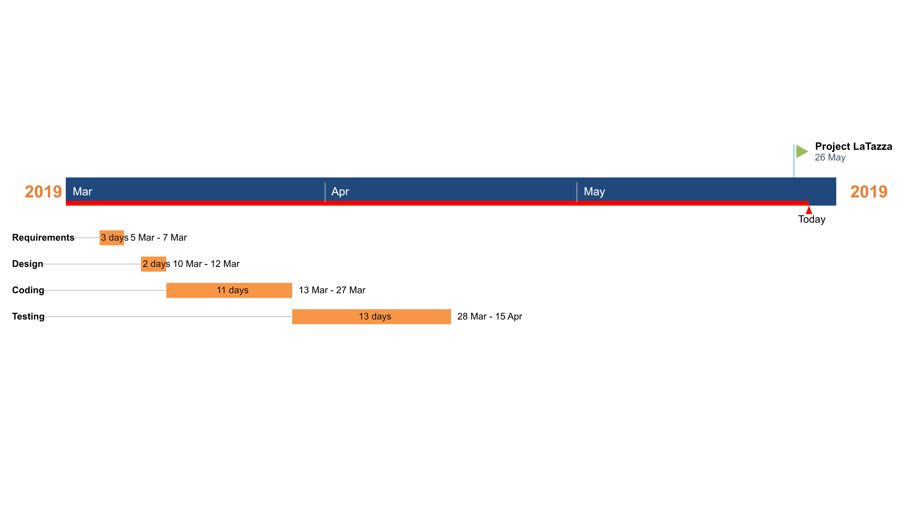

# Project Estimation  template

Authors: 

- Rosetta Pagliuca s262725
- Raniero Pirraglia s263597
- Mohamed Mamdouh Tourab s259371
- Antonino Vitale 262665

Date: 02/06/2019

Version: 1.0

# Contents

# Data from your LaTazza project

###

|                                                              |              |
| ------------------------------------------------------------ | ------------ |
| Total person hours  worked by your  team, considering period March 5 to May 26, considering ALL activities (req, des, code, test,..) | 168          |
| Total Java LoC delivered on May 26 (only code, without Exceptions, no Junit code) | 846          |
| Total number of Java classes delivered on May 26 (only code, no Junit code, no Exception classes) | 11           |
| Productivity P =                                             | 40 [LOC/day] |
| Average size of Java class A =                               | 77           |

# Estimate by product decomposition

### 

|                                                              | Estimate |
| ------------------------------------------------------------ | -------- |
| Estimated n classes NC (no Exception classes)                | 15       |
| Estimated LOC per class  (Here use Average A computed above ) | 77       |
| Estimated LOC (= NC * A)                                     | 1155     |
| Estimated effort  (person days) (Here use productivity P)    | 29       |
| Estimated calendar time (calendar weeks) (Assume team of 4 people, 8 hours per day, 5 days per week ) | 1,45     |

# Estimate by activity decomposition

### 

| Activity name | Estimated effort [person days] |
| ------------- | ------------------------------ |
| Requirement   | 3                              |
| Design        | 2                              |
| Coding        | 11                             |
| Testing       | 13                             |

###
